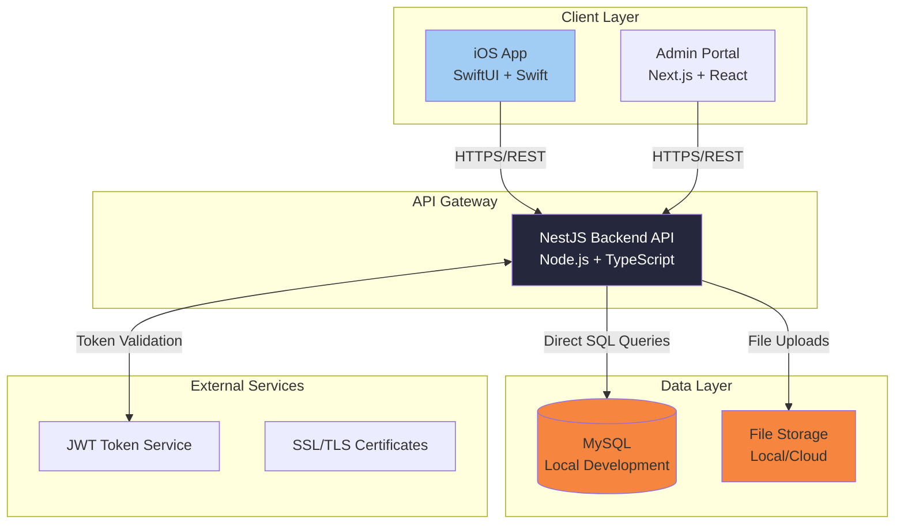
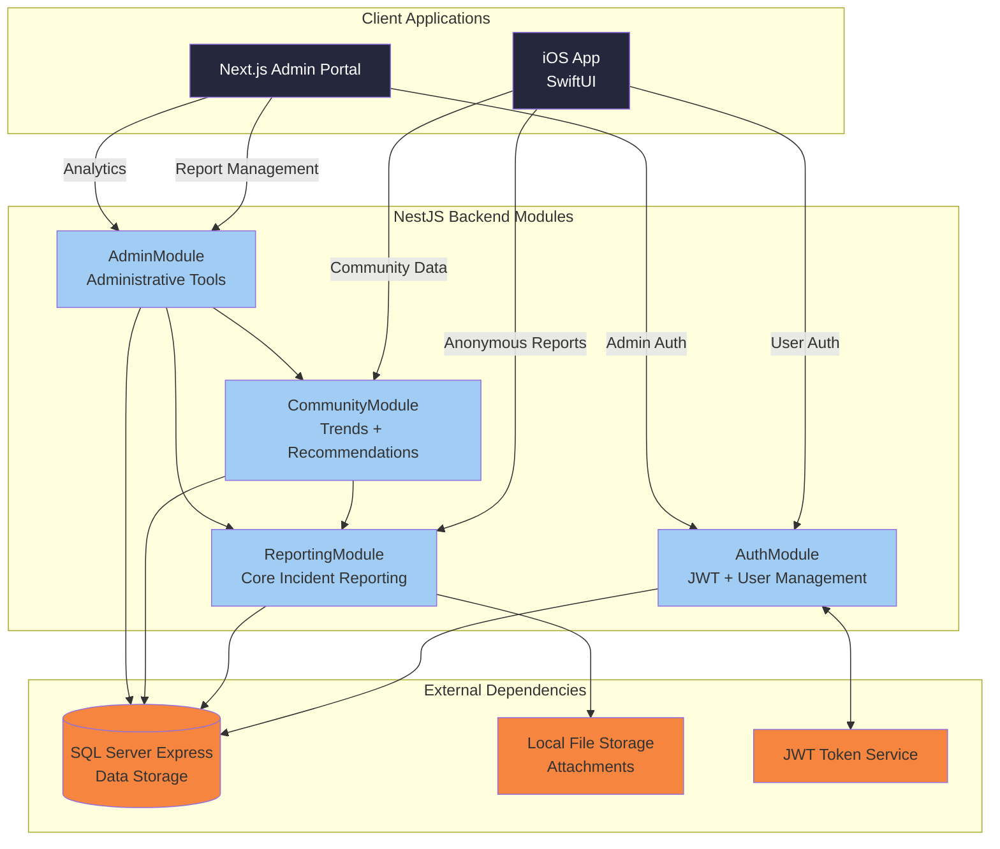
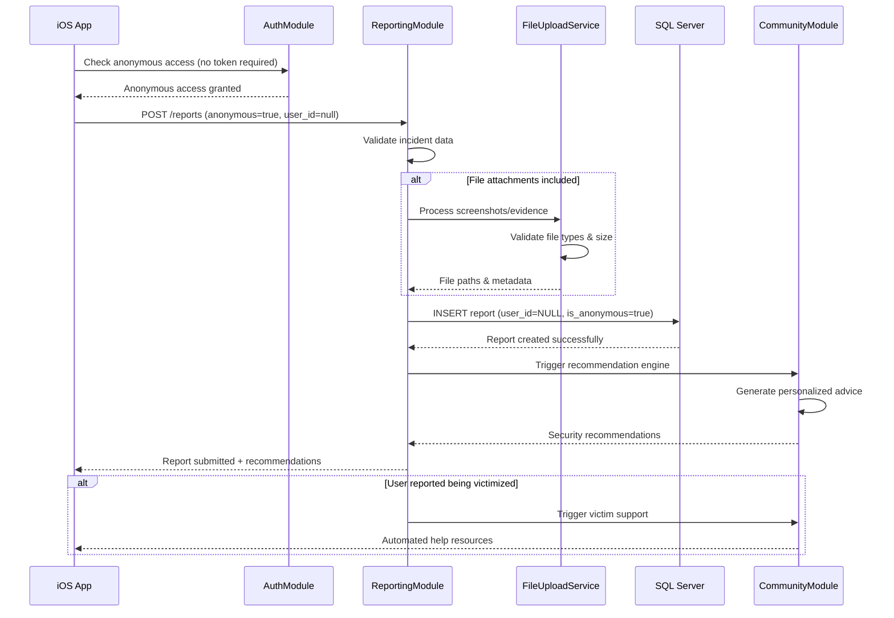
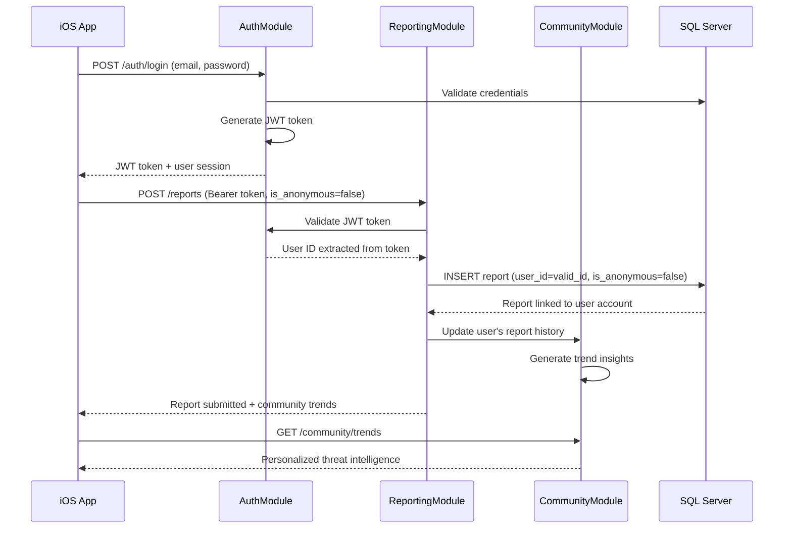
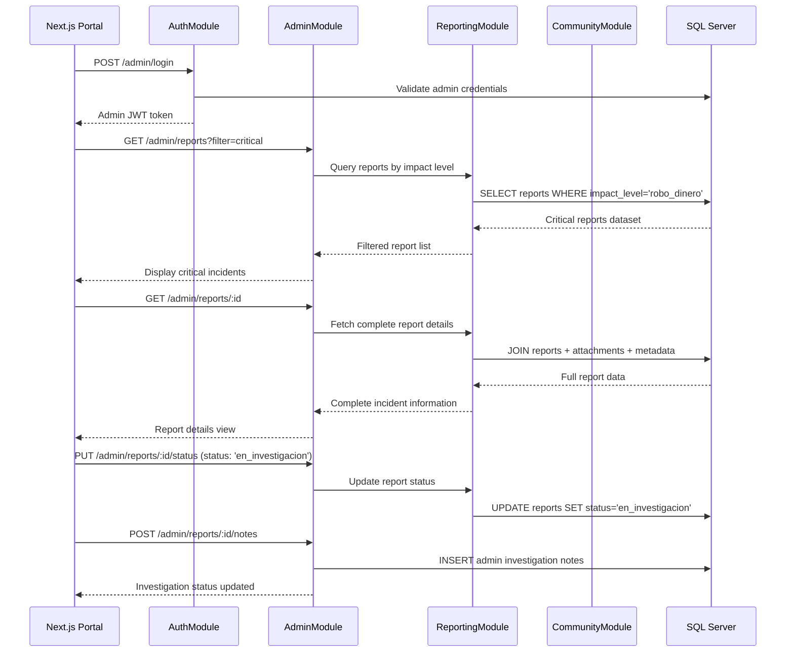

# SafeTrade Architecture Document

## Goals and Background Context

This document outlines the overall project architecture for **SafeTrade**, including backend systems, shared services, and non-UI specific concerns. Its primary goal is to serve as the guiding architectural blueprint for AI-driven development, ensuring consistency and adherence to chosen patterns and technologies.

**Relationship to Frontend Architecture:**
Since SafeTrade includes a significant iOS mobile application, a separate Frontend Architecture Document will detail the frontend-specific design and MUST be used in conjunction with this document. Core technology stack choices documented herein (see "Tech Stack") are definitive for the entire project, including any frontend components.

## Introduction

### Starter Template or Existing Project

**Starter Templates Selected:**
1. **SwiftUI Starter App** - iOS foundation with SwiftUI framework setup
2. **NestJS** - Node.js backend framework (instead of Express mentioned in PRD)  
3. **Next.js** - React framework for admin portal (instead of vanilla React)

**Architecture Impact Analysis:**
- **NestJS vs Express:** NestJS provides enterprise-grade structure with TypeScript, dependency injection, and decorators - excellent for the modular architecture needed for SafeTrade's authentication, reporting, and analytics services
- **Next.js vs React:** Next.js offers SSR/SSG capabilities and better SEO for the admin portal, plus built-in API routes that could supplement the main NestJS backend
- **SwiftUI Starter:** Provides modern iOS development foundation with declarative UI perfect for SafeTrade's mobile-first approach

**Benefits for Academic Project:**
- Faster setup and configuration
- Built-in best practices and project structure
- TypeScript throughout (NestJS + Next.js) for better code quality
- Production-ready foundations for all three major components

### Change Log
| Date | Version | Description | Author |
|------|---------|-------------|---------|
| 2025-09-11 | 1.0 | Initial architecture creation from PRD | Winston (Architect Agent) |
| 2025-01-15 | 2.0 | Updated to reflect new modular structure and MySQL implementation | Winston (Architect Agent) |

## High Level Architecture

### Technical Summary

SafeTrade employs a **modern modular monolith architecture** with native mobile client, enterprise-grade backend API, and web-based administrative interface. The system uses **NestJS with repository pattern** for rapid development with clear module boundaries, **MySQL relational database** with direct query approach for performance and simplicity, and **triple JWT-based authentication** supporting anonymous, registered user, and admin flows. Core architectural patterns include **Repository Pattern** for data access, **Service Layer Architecture** for business logic separation, and **Module Reuse Strategy** for admin functionality. This architecture directly supports PRD goals by enabling friction-free mobile reporting, community intelligence aggregation, and administrative oversight while maintaining 99.5% uptime and sub-2-second response times.

### High Level Overview

**Architectural Style:** Modular Monolith with Microservice-Ready Design
- Single deployable NestJS backend with clear module boundaries (auth, reporting, analytics, community)
- Internal service separation enables future microservice migration as community scales

**Repository Structure:** Monorepo (from PRD)
- Unified codebase management for iOS app, NestJS backend, and Next.js admin portal
- Shared TypeScript types and utilities across backend and admin frontend

**Service Architecture:** NestJS Modular Backend with Repository Pattern
- Controller → Service → Repository pattern for clean separation
- Internal module architecture: AuthModule, UsersModule, ReportesModule, ComunidadModule, AdminModule
- Admin module reuses existing UsersService and ReportesService for DRY principle

**Primary User Interaction Flow:**
1. **Mobile Entry:** iOS app → Authentication choice (anonymous/registered) → Report submission → Community trends
2. **Data Flow:** Mobile reports → NestJS API → MySQL → Analytics processing → Community insights
3. **Admin Flow:** Web portal → Report management → Status updates → Analytics dashboard

**Key Architectural Decisions:**
- **NestJS over Express:** Enterprise patterns, TypeScript-first, dependency injection for scalable module architecture
- **Next.js for Admin:** SSR capabilities, built-in optimizations, potential API route supplementation
- **MySQL with Direct Queries:** Direct SQL approach for performance and simplicity over ORM abstraction
- **Triple JWT Authentication:** Anonymous access, user tokens, and admin tokens with different permissions

### High Level Project Diagram



### Architectural and Design Patterns

**Core Patterns Selected:**

- **Modular Monolith Architecture:** NestJS modules (Auth, Reporting, Analytics, Community) with clear boundaries - _Rationale:_ Balances development speed with future scalability, perfect for academic timeline while maintaining enterprise structure

- **Repository Pattern:** Abstract data access through repositories and services - _Rationale:_ Enables testing, database migration flexibility, and clean separation between business logic and data persistence

- **JWT Stateless Authentication:** Token-based authentication with refresh rotation - _Rationale:_ Supports both anonymous and identified user flows, scalable across multiple clients (iOS + web)

- **Event-Driven Notifications:** Internal event system for user actions and report processing - _Rationale:_ Decouples components, enables future real-time features, supports analytics tracking

- **Service Layer Pattern:** Business logic encapsulated in NestJS services - _Rationale:_ Clear separation of concerns, testable business rules, dependency injection support

- **API Gateway Pattern:** Single NestJS backend serving multiple clients - _Rationale:_ Unified API surface, consistent authentication, simplified deployment for academic project

## Tech Stack

### Cloud Infrastructure
- **Provider:** Local/Self-hosted development environment
- **Key Services:** SQL Server Express (local), Let's Encrypt SSL, local file storage
- **Deployment Regions:** Local development, single production deployment

### Technology Stack Table

| Category | Technology | Version | Purpose | Rationale |
|----------|------------|---------|---------|-----------|
| **Language** | TypeScript | 5.2.0 | Primary backend language | Strong typing, excellent tooling, NestJS requirement |
| **Runtime** | Node.js | 18.17.0 LTS | JavaScript runtime | LTS stability, NestJS compatibility, academic reliability |
| **Backend Framework** | NestJS | 10.2.0 | Enterprise API framework | Modular architecture, DI, TypeScript-first, scalable patterns |
| **Database** | SQL Server Express | 2019 | Local development database | Free for academic use, full SQL Server features, 10GB limit sufficient |
| **Database ORM** | Sequelize | 6.32.0 | SQL Server integration | Migration support, TypeScript definitions, query optimization |
| **Authentication** | JWT + bcrypt | jsonwebtoken@9.0.0, bcrypt@5.1.0 | Token-based auth | Stateless sessions, anonymous + identified flows support |
| **iOS Framework** | SwiftUI | iOS 14+ | Native iOS development | Declarative UI, modern iOS patterns, starter template choice |
| **iOS Language** | Swift | 5.8+ | iOS development language | Native performance, type safety, Apple ecosystem integration |
| **Admin Framework** | Next.js | 13.4.0 | React-based admin portal | SSR/SSG capabilities, built-in optimization, starter template choice |
| **Admin Language** | TypeScript | 5.2.0 | Admin portal development | Type safety, consistent with backend, developer productivity |
| **Testing Framework** | Jest + Supertest | jest@29.5.0, supertest@6.3.0 | Backend testing | NestJS integration, API testing, academic project standard |
| **iOS Testing** | XCTest | Built-in | iOS unit testing | Native iOS testing framework, integrated with Xcode |
| **File Upload** | Multer | 1.4.5 | Secure file handling | NestJS compatibility, validation support, local storage |
| **Validation** | class-validator | 0.14.0 | Input validation | Decorator-based validation, TypeScript integration, security focus |
| **Logging** | Winston | 3.9.0 | Application logging | Structured logging, multiple transports, NestJS integration |
| **Development Tools** | ESLint + Prettier | eslint@8.44.0, prettier@3.0.0 | Code quality | Consistent formatting, error prevention, team collaboration |
| **Environment Config** | dotenv | 16.3.0 | Environment variable management | Team configuration consistency, secret management |

### Environment Configuration Strategy

**Local Development Setup:**
- **`.env.example`** - Template file committed to repo with all required variables (no sensitive values)
- **`.env`** - Local environment file (gitignored) each developer creates from template
- **Team shared values** - Database connection strings, API URLs documented in project README
- **Individual secrets** - JWT secrets, admin passwords generated per developer

**Configuration Categories:**
```bash
# Database Configuration
DB_HOST=localhost
DB_PORT=1433
DB_NAME=safetrade_dev
DB_USER=sa
DB_PASSWORD=[individual_password]

# JWT Configuration  
JWT_SECRET=[individual_secret]
JWT_EXPIRES_IN=1h
JWT_REFRESH_SECRET=[individual_refresh_secret]

# File Upload Configuration
UPLOAD_PATH=./uploads
MAX_FILE_SIZE=10485760

# Application Configuration
NODE_ENV=development
PORT=3000
API_PREFIX=api/v1
```

## Data Models

### User Model
**Purpose:** Optional user registration for identified reporting and report history tracking

**Key Attributes:**
- user_id: UUID (Primary Key) - Unique user identifier
- email: string - User email address for authentication
- password_hash: string - bcrypt hashed password
- jwt_token: string (nullable) - Current active session token
- created_at: datetime - Account creation timestamp
- updated_at: datetime - Last account modification timestamp

**Relationships:**
- One-to-Many with Reports (for identified reports only)
- Reports can exist without User (anonymous reporting)

### Report Model  
**Purpose:** Core incident reporting data supporting both anonymous and identified submissions

**Key Attributes:**
- report_id: UUID (Primary Key) - Unique report identifier
- user_id: UUID (Foreign Key, nullable) - Links to User for identified reports, NULL for anonymous
- is_anonymous: boolean - Explicit flag for report type (true = anonymous, false = identified)
- attack_type: enum - ['email', 'SMS', 'whatsapp', 'llamada', 'redes_sociales', 'otro']
- incident_date: date - When the attack occurred
- incident_time: time - Time of attack occurrence
- attack_origin: string - Phone number or email address of attacker
- suspicious_url: string (nullable) - Malicious URL if applicable
- message_content: text (nullable) - Original attack message content
- impact_level: enum - ['ninguno', 'robo_datos', 'robo_dinero', 'cuenta_comprometida']
- description: text - Free-text detailed description
- status: enum - ['nuevo', 'revisado', 'en_investigacion', 'cerrado']
- created_at: datetime - Report submission timestamp
- updated_at: datetime - Last report modification

**Relationships:**
- Many-to-One with User (nullable for anonymous reports)
- One-to-Many with ReportAttachments

### ReportAttachment Model
**Purpose:** File uploads (screenshots, evidence) associated with incident reports

**Key Attributes:**
- attachment_id: UUID (Primary Key) - Unique attachment identifier
- report_id: UUID (Foreign Key) - Links to parent Report
- file_name: string - Original uploaded filename
- file_path: string - Server storage path
- file_size: integer - File size in bytes
- mime_type: string - File type validation
- uploaded_at: datetime - Upload timestamp

**Relationships:**
- Many-to-One with Report

### AdminUser Model
**Purpose:** Administrative portal access for SafeTrade company users

**Key Attributes:**
- admin_id: UUID (Primary Key) - Unique admin identifier
- email: string - Admin email address
- password_hash: string - bcrypt hashed password
- last_login: datetime (nullable) - Last login timestamp
- created_at: datetime - Account creation timestamp

**Relationships:**
- Independent entity (no direct relationships with user reports for privacy)

## Components

### AuthModule
**Responsibility:** Handle all authentication flows including anonymous access, user registration/login, JWT token management, and admin authentication

**Key Interfaces:**
- POST `/auth/register` - User registration endpoint
- POST `/auth/login` - User authentication endpoint  
- POST `/auth/refresh` - JWT token refresh
- POST `/admin/login` - Admin authentication endpoint
- GET `/auth/verify` - Token validation middleware

**Dependencies:** UserService, AdminUserService, JWT utilities, bcrypt hashing

**Technology Stack:** NestJS Guards, JWT Strategy, Passport.js integration, bcrypt password hashing

### ReportingModule  
**Responsibility:** Core incident reporting functionality supporting both anonymous and identified report submissions, file uploads, and report management

**Key Interfaces:**
- POST `/reports` - Submit new incident report (anonymous or identified)
- GET `/reports` - Retrieve reports (admin only, with filtering/pagination)
- GET `/reports/:id` - Get specific report details
- PUT `/reports/:id/status` - Update report status (admin only)
- POST `/reports/:id/attachments` - Upload file attachments

**Dependencies:** ReportService, FileUploadService, ValidationService, AuthModule

**Technology Stack:** Multer file upload, class-validator input validation, Sequelize ORM integration

### CommunityModule
**Responsibility:** Community intelligence features including threat trends analysis, personalized security recommendations, and automated victim support

**Key Interfaces:**
- GET `/community/trends` - Popular attack patterns and trends
- GET `/community/recommendations/:reportId` - Personalized security advice
- GET `/community/support/:reportId` - Victim support resources
- GET `/community/analytics` - Community-level threat analytics

**Dependencies:** ReportingModule, AnalyticsService, RecommendationEngine

**Technology Stack:** Data aggregation queries, caching for performance, recommendation algorithms

### AdminModule
**Responsibility:** Administrative portal functionality including report management, advanced filtering, status updates, and investigation tracking

**Key Interfaces:**
- GET `/admin/dashboard` - Admin dashboard with key metrics
- GET `/admin/reports` - Advanced report search and filtering
- PUT `/admin/reports/:id/notes` - Add investigation notes
- GET `/admin/analytics` - Comprehensive platform analytics
- GET `/admin/exports` - Data export functionality

**Dependencies:** ReportingModule, CommunityModule, AuthModule (admin guards)

**Technology Stack:** Advanced SQL queries, data export utilities, admin-specific Guards

### Component Diagrams



## Core Workflows

### Anonymous Incident Reporting Workflow



### Registered User Identified Reporting Workflow



### Admin Report Investigation Workflow



## Implemented Spanish Endpoints

### Summary of Current Implementation

The restructured SafeTrade backend now implements the following Spanish endpoints following the new modular pattern:

**Authentication Endpoints:**
- `POST /auth/login` - User authentication
- `POST /auth/refresh` - Token renewal
- `GET /auth/profile` - User profile (requires JWT)

**User Management:**
- `POST /users/register` - User registration
- `GET /users/profile` - User profile (authenticated)

**Incident Reporting (Spanish Module Names):**
- `POST /reportes` - Create incident report (anonymous + authenticated)
- `GET /reportes/:id` - Get specific report details
- `GET /reportes/user/mis-reportes` - User's own reports (authenticated)

**Community Intelligence (Spanish Module Names):**
- `GET /comunidad/tendencias` - Community threat trends
- `GET /comunidad/recomendaciones/:reporteId` - Personalized security recommendations
- `GET /comunidad/analytics` - Community analytics
- `GET /comunidad/alerta` - Community alert status

**Admin Management:**
- `POST /admin/login` - Admin authentication
- `GET /admin/users/list` - All users list (admin only)
- `GET /admin/users/:id` - Specific user details (admin only)
- `GET /admin/dashboard` - Admin dashboard statistics
- `GET /admin/reportes` - Filtered reports list (admin only)

### Key Implementation Features

- **Triple Authentication**: Anonymous access, JWT user tokens, JWT admin tokens
- **Repository Pattern**: Controller → Service → Repository for all modules
- **Module Reuse**: Admin module reuses UsersService and ReportesService
- **Spanish Localization**: All endpoints, responses, and error messages in Spanish
- **File Upload Support**: Incident reports can include screenshot attachments
- **Community Intelligence**: Automated threat trend analysis and personalized recommendations

## REST API Spec

```yaml
openapi: 3.0.0
info:
  title: SafeTrade Cybersecurity Incident Reporting API
  version: 1.0.0
  description: RESTful API for SafeTrade platform supporting anonymous and identified cybersecurity incident reporting with community intelligence features
servers:
  - url: http://localhost:3000/
    description: Local development server

components:
  securitySchemes:
    BearerAuth:
      type: http
      scheme: bearer
      bearerFormat: JWT
    AdminAuth:
      type: http
      scheme: bearer
      bearerFormat: JWT
      description: Admin-specific JWT token
  
  schemas:
    User:
      type: object
      properties:
        user_id:
          type: string
          format: uuid
        email:
          type: string
          format: email
        created_at:
          type: string
          format: date-time
    
    Report:
      type: object
      properties:
        report_id:
          type: string
          format: uuid
        user_id:
          type: string
          format: uuid
          nullable: true
        is_anonymous:
          type: boolean
        attack_type:
          type: string
          enum: [email, SMS, whatsapp, llamada, redes_sociales, otro]
        incident_date:
          type: string
          format: date
        incident_time:
          type: string
          format: time
        attack_origin:
          type: string
          description: Phone number or email of attacker
        suspicious_url:
          type: string
          format: uri
          nullable: true
        message_content:
          type: string
          nullable: true
        impact_level:
          type: string
          enum: [ninguno, robo_datos, robo_dinero, cuenta_comprometida]
        description:
          type: string
        status:
          type: string
          enum: [nuevo, revisado, en_investigacion, cerrado]
        created_at:
          type: string
          format: date-time
    
    TrendData:
      type: object
      properties:
        attack_type:
          type: string
        count:
          type: integer
        percentage:
          type: number
        time_period:
          type: string

paths:
  # Authentication Endpoints
  /auth/register:
    post:
      tags: [Authentication]
      summary: Register new user account
      requestBody:
        required: true
        content:
          application/json:
            schema:
              type: object
              required: [email, password]
              properties:
                email:
                  type: string
                  format: email
                password:
                  type: string
                  minLength: 8
      responses:
        '201':
          description: User registered successfully
          content:
            application/json:
              schema:
                type: object
                properties:
                  access_token:
                    type: string
                  user:
                    $ref: '#/components/schemas/User'
        '400':
          description: Invalid email or password requirements not met
        '409':
          description: Email already registered
  
  /auth/login:
    post:
      tags: [Authentication]
      summary: User login
      requestBody:
        required: true
        content:
          application/json:
            schema:
              type: object
              required: [email, password]
              properties:
                email:
                  type: string
                  format: email
                password:
                  type: string
      responses:
        '200':
          description: Login successful
          content:
            application/json:
              schema:
                type: object
                properties:
                  access_token:
                    type: string
                  refresh_token:
                    type: string
                  user:
                    $ref: '#/components/schemas/User'
        '401':
          description: Invalid credentials

  # Incident Reporting Endpoints
  /reports:
    post:
      tags: [Reporting]
      summary: Submit incident report (anonymous or identified)
      security:
        - BearerAuth: []
        - {} # Anonymous access allowed
      requestBody:
        required: true
        content:
          multipart/form-data:
            schema:
              type: object
              required: [attack_type, incident_date, attack_origin, impact_level]
              properties:
                is_anonymous:
                  type: boolean
                  default: true
                attack_type:
                  type: string
                  enum: [email, SMS, whatsapp, llamada, redes_sociales, otro]
                incident_date:
                  type: string
                  format: date
                incident_time:
                  type: string
                  format: time
                attack_origin:
                  type: string
                suspicious_url:
                  type: string
                  format: uri
                message_content:
                  type: string
                impact_level:
                  type: string
                  enum: [ninguno, robo_datos, robo_dinero, cuenta_comprometida]
                description:
                  type: string
                attachments:
                  type: array
                  items:
                    type: string
                    format: binary
      responses:
        '201':
          description: Report submitted successfully
          content:
            application/json:
              schema:
                type: object
                properties:
                  report:
                    $ref: '#/components/schemas/Report'
                  recommendations:
                    type: array
                    items:
                      type: string
                  victim_support:
                    type: object
                    nullable: true
        '400':
          description: Invalid report data or file upload error
    
    get:
      tags: [Reporting]
      summary: Get reports (admin only)
      security:
        - AdminAuth: []
      parameters:
        - name: status
          in: query
          schema:
            type: string
            enum: [nuevo, revisado, en_investigacion, cerrado]
        - name: attack_type
          in: query
          schema:
            type: string
        - name: impact_level
          in: query
          schema:
            type: string
        - name: date_from
          in: query
          schema:
            type: string
            format: date
        - name: date_to
          in: query
          schema:
            type: string
            format: date
        - name: page
          in: query
          schema:
            type: integer
            default: 1
        - name: limit
          in: query
          schema:
            type: integer
            default: 20
      responses:
        '200':
          description: Paginated list of reports
          content:
            application/json:
              schema:
                type: object
                properties:
                  reports:
                    type: array
                    items:
                      $ref: '#/components/schemas/Report'
                  pagination:
                    type: object
                    properties:
                      total:
                        type: integer
                      page:
                        type: integer
                      pages:
                        type: integer
        '401':
          description: Admin authentication required

  # Community Intelligence Endpoints
  /community/trends:
    get:
      tags: [Community]
      summary: Get community threat trends
      parameters:
        - name: period
          in: query
          schema:
            type: string
            enum: [7days, 30days, 90days]
            default: 30days
        - name: region
          in: query
          schema:
            type: string
      responses:
        '200':
          description: Community threat trends data
          content:
            application/json:
              schema:
                type: object
                properties:
                  trends:
                    type: array
                    items:
                      $ref: '#/components/schemas/TrendData'
                  total_reports:
                    type: integer
                  period:
                    type: string
  
  /community/recommendations/{reportId}:
    get:
      tags: [Community]
      summary: Get personalized security recommendations
      parameters:
        - name: reportId
          in: path
          required: true
          schema:
            type: string
            format: uuid
      responses:
        '200':
          description: Personalized security recommendations
          content:
            application/json:
              schema:
                type: object
                properties:
                  recommendations:
                    type: array
                    items:
                      type: object
                      properties:
                        title:
                          type: string
                        content:
                          type: string
                        priority:
                          type: string
                          enum: [alta, media, baja]

  # Admin Management Endpoints
  /admin/login:
    post:
      tags: [Admin]
      summary: Admin authentication
      requestBody:
        required: true
        content:
          application/json:
            schema:
              type: object
              required: [email, password]
              properties:
                email:
                  type: string
                  format: email
                password:
                  type: string
      responses:
        '200':
          description: Admin login successful
          content:
            application/json:
              schema:
                type: object
                properties:
                  access_token:
                    type: string
                  admin_id:
                    type: string
                    format: uuid
        '401':
          description: Invalid admin credentials

  /admin/dashboard:
    get:
      tags: [Admin]
      summary: Admin dashboard metrics
      security:
        - AdminAuth: []
      responses:
        '200':
          description: Dashboard statistics
          content:
            application/json:
              schema:
                type: object
                properties:
                  total_reports:
                    type: integer
                  reports_today:
                    type: integer
                  critical_reports:
                    type: integer
                  recent_trends:
                    type: array
                    items:
                      $ref: '#/components/schemas/TrendData'

  /admin/reports/{reportId}/status:
    put:
      tags: [Admin]
      summary: Update report status
      security:
        - AdminAuth: []
      parameters:
        - name: reportId
          in: path
          required: true
          schema:
            type: string
            format: uuid
      requestBody:
        required: true
        content:
          application/json:
            schema:
              type: object
              required: [status]
              properties:
                status:
                  type: string
                  enum: [nuevo, revisado, en_investigacion, cerrado]
                notes:
                  type: string
      responses:
        '200':
          description: Report status updated
        '404':
          description: Report not found
        '401':
          description: Admin authentication required
```

## Database Schema

```sql
-- SafeTrade MySQL Database Schema
-- Cybersecurity Incident Reporting Platform

-- Drop tables if they exist (for clean setup)
DROP TABLE IF EXISTS reporte_adjuntos;
DROP TABLE IF EXISTS reportes;
DROP TABLE IF EXISTS admin_users;
DROP TABLE IF EXISTS users;

-- Users table (optional registration for identified reporting)
CREATE TABLE users (
    id INT AUTO_INCREMENT PRIMARY KEY,
    email VARCHAR(255) UNIQUE NOT NULL,
    name VARCHAR(255),
    password_hash VARCHAR(255) NOT NULL,
    salt VARCHAR(255) NOT NULL,
    created_at TIMESTAMP DEFAULT CURRENT_TIMESTAMP,
    updated_at TIMESTAMP DEFAULT CURRENT_TIMESTAMP ON UPDATE CURRENT_TIMESTAMP
);

-- Admin users table (separate from regular users for security)
CREATE TABLE admin_users (
    id INT AUTO_INCREMENT PRIMARY KEY,
    email VARCHAR(255) UNIQUE NOT NULL,
    password_hash VARCHAR(255) NOT NULL,
    salt VARCHAR(255) NOT NULL,
    last_login TIMESTAMP NULL,
    created_at TIMESTAMP DEFAULT CURRENT_TIMESTAMP
);

-- Reports table (core incident reporting - Spanish field names where appropriate)
CREATE TABLE reportes (
    id INT AUTO_INCREMENT PRIMARY KEY,
    user_id INT NULL, -- NULL for anonymous reports
    is_anonymous BOOLEAN DEFAULT TRUE,

    -- Attack details
    attack_type ENUM('email', 'SMS', 'whatsapp', 'llamada', 'redes_sociales', 'otro') NOT NULL,
    incident_date DATE NOT NULL,
    incident_time TIME NULL,
    attack_origin VARCHAR(255) NOT NULL, -- Phone number or email of attacker

    -- Optional evidence
    suspicious_url TEXT NULL,
    message_content TEXT NULL, -- Original attack message
    description TEXT NULL, -- Free-text description

    -- Impact assessment
    impact_level ENUM('ninguno', 'robo_datos', 'robo_dinero', 'cuenta_comprometida') NOT NULL,

    -- Administrative fields
    status ENUM('nuevo', 'revisado', 'en_investigacion', 'cerrado') DEFAULT 'nuevo',
    admin_notes TEXT NULL, -- Investigation notes

    -- Timestamps
    created_at TIMESTAMP DEFAULT CURRENT_TIMESTAMP,
    updated_at TIMESTAMP DEFAULT CURRENT_TIMESTAMP ON UPDATE CURRENT_TIMESTAMP,

    -- Foreign key constraints
    FOREIGN KEY (user_id) REFERENCES users(id) ON DELETE SET NULL,

    -- Indexes for performance
    INDEX idx_attack_type (attack_type),
    INDEX idx_incident_date (incident_date),
    INDEX idx_status (status),
    INDEX idx_impact_level (impact_level),
    INDEX idx_anonymous (is_anonymous),
    INDEX idx_user_id (user_id),
    INDEX idx_created_at (created_at)
);

-- Report attachments table (screenshots and evidence files)
CREATE TABLE reporte_adjuntos (
    id INT AUTO_INCREMENT PRIMARY KEY,
    reporte_id INT NOT NULL,

    -- File information
    file_name VARCHAR(255) NOT NULL,
    original_name VARCHAR(255) NOT NULL, -- User's original filename
    file_path VARCHAR(500) NOT NULL, -- Server storage path
    file_size BIGINT NOT NULL, -- Size in bytes
    mime_type VARCHAR(100) NOT NULL, -- Content type validation

    -- Security and integrity
    file_hash VARCHAR(64) NULL, -- SHA-256 for integrity
    scan_status ENUM('pending', 'clean', 'quarantined') DEFAULT 'pending',

    uploaded_at TIMESTAMP DEFAULT CURRENT_TIMESTAMP,

    FOREIGN KEY (reporte_id) REFERENCES reportes(id) ON DELETE CASCADE,

    -- Performance indexes
    INDEX idx_reporte_id (reporte_id),
    INDEX idx_scan_status (scan_status)
);

-- Insert sample admin user (password: 'admin123' - hashed with salt)
-- Note: In production, use proper password hashing with bcrypt
INSERT INTO admin_users (email, password_hash, salt) VALUES
('admin@safetrade.com', 'e3b0c44298fc1c149afbf4c8996fb92427ae41e4649b934ca495991b7852b855', 'admin_salt');

-- Create sample user for testing
INSERT INTO users (email, name, password_hash, salt) VALUES
('user@test.com', 'Usuario de Prueba', 'e3b0c44298fc1c149afbf4c8996fb92427ae41e4649b934ca495991b7852b855', 'user_salt');

-- Insert sample reports for testing
INSERT INTO reportes (user_id, is_anonymous, attack_type, incident_date, attack_origin, impact_level, description) VALUES
(1, FALSE, 'email', '2025-01-15', 'scammer@fake.com', 'ninguno', 'Correo de phishing solicitando credenciales bancarias'),
(NULL, TRUE, 'whatsapp', '2025-01-14', '+1234567890', 'robo_datos', 'Mensaje de WhatsApp con enlace malicioso');
```

## Source Tree

```
bmad-cyber-report/
├── packages/
│   ├── backend/                           # NestJS API Server
│   │   ├── src/
│   │   │   ├── auth/                      # AuthModule - Triple authentication
│   │   │   │   ├── auth.controller.ts     # User/admin login endpoints
│   │   │   │   ├── auth.service.ts        # Authentication logic
│   │   │   │   ├── auth.module.ts         # Module definition
│   │   │   │   ├── token.service.ts       # JWT token management
│   │   │   │   └── admin.repository.ts    # Admin user database operations
│   │   │   ├── users/                     # UsersModule - Repository pattern
│   │   │   │   ├── users.controller.ts    # User registration, profile
│   │   │   │   ├── users.service.ts       # User business logic
│   │   │   │   ├── users.repository.ts    # User database operations
│   │   │   │   └── users.module.ts        # Module definition
│   │   │   ├── reportes/                  # ReportesModule - Spanish endpoints
│   │   │   │   ├── reportes.controller.ts # POST /reportes, GET /reportes/:id
│   │   │   │   ├── reportes.service.ts    # Report business logic + recommendations
│   │   │   │   ├── reportes.repository.ts # Report database operations
│   │   │   │   ├── reportes.module.ts     # Module definition
│   │   │   │   └── dto/
│   │   │   │       └── crear-reporte.dto.ts # Spanish DTOs
│   │   │   ├── comunidad/                 # ComunidadModule - Spanish endpoints
│   │   │   │   ├── comunidad.controller.ts # GET /comunidad/tendencias, etc.
│   │   │   │   ├── comunidad.service.ts   # Community intelligence + translations
│   │   │   │   ├── comunidad.repository.ts # Community analytics database
│   │   │   │   └── comunidad.module.ts    # Module definition
│   │   │   ├── admin/                     # AdminModule - Reuses services
│   │   │   │   ├── admin.controller.ts    # GET /admin/users/list, /admin/users/:id
│   │   │   │   ├── admin.service.ts       # Reuses UsersService + ReportesService
│   │   │   │   ├── admin.repository.ts    # Admin-specific database operations
│   │   │   │   └── admin.module.ts        # Imports UsersModule, AuthModule
│   │   │   ├── common/                    # Shared guards and interfaces
│   │   │   │   ├── guards/
│   │   │   │   │   ├── jwt-auth.guard.ts      # Standard JWT guard
│   │   │   │   │   ├── admin-auth.guard.ts    # Admin-only access guard
│   │   │   │   │   └── anonymous-auth.guard.ts # Anonymous + auth access
│   │   │   │   └── interfaces/
│   │   │   │       └── authenticated-request.ts # Request types
│   │   │   ├── db/                        # Database module
│   │   │   │   ├── db.module.ts           # Global database module
│   │   │   │   └── db.service.ts          # MySQL connection pool
│   │   │   ├── util/                      # Utility functions
│   │   │   │   └── hash/
│   │   │   │       └── hash.util.ts       # Password hashing
│   │   │   ├── app.module.ts              # Root NestJS module
│   │   │   ├── app.controller.ts          # Health checks
│   │   │   ├── app.service.ts             # Basic app services
│   │   │   └── main.ts                    # Application entry point + Swagger
│   │   ├── database/                      # MySQL schema and setup
│   │   │   └── safetrade_schema.sql       # Complete MySQL schema
│   │   ├── uploads/                       # File upload storage
│   │   │   └── temp/                      # Temporary upload processing
│   │   ├── test/                          # E2E tests
│   │   │   ├── app.e2e-spec.ts            # Application tests
│   │   │   └── jest-e2e.json              # Jest E2E configuration
│   │   ├── package.json                   # Dependencies and scripts
│   │   ├── tsconfig.json                  # TypeScript configuration
│   │   └── nest-cli.json                  # NestJS CLI configuration
│   │   ├── .env.example                   # Environment template
│   │   └── README.md                      # Backend documentation
│   │
├── docs/                                  # Project documentation
│   ├── prd.md                            # Product Requirements Document
│   ├── architecture.md                   # This architecture document
│   └── stories/                          # User stories and development tasks
└── README.md                             # Main project documentation

### Key Implementation Features

**Modular Architecture:**
- Clean separation: Controller → Service → Repository
- Module reuse: AdminModule imports and reuses UsersModule services
- Dependency injection throughout all modules

**Database Strategy:**
- MySQL with direct queries for performance
- Repository pattern for data access abstraction
- No ORM overhead - direct SQL for complex queries

**Authentication Strategy:**
- Anonymous access for friction-free reporting
- JWT tokens for registered users
- Separate admin JWT tokens with enhanced permissions
- All three access patterns supported by guards

**Spanish Localization:**
- Module names: reportes/, comunidad/
- Endpoint paths: /reportes, /comunidad/tendencias
- DTOs and validation messages in Spanish
- Database enums with Spanish values
```

## Implementation Summary

The SafeTrade backend has been successfully restructured using the new modular architecture pattern with MySQL database and Spanish localization. The implementation includes:

### Completed Modules:
- **DbModule**: MySQL connection with direct query approach
- **UsersModule**: Repository pattern for user management
- **AuthModule**: Triple authentication (anonymous, user, admin)
- **AdminModule**: Admin management that reuses existing services
- **ReportesModule**: Spanish incident reporting endpoints
- **ComunidadModule**: Community intelligence and trends

### Key Spanish Endpoints:
- `POST /reportes` - Create cybersecurity incident reports
- `GET /comunidad/tendencias` - Community threat trends
- `GET /admin/users/list` - Admin user management
- All responses and error messages in Spanish

### Database Implementation:
- MySQL schema with proper indexing for performance
- Spanish enum values for attack types and impact levels
- Support for anonymous and identified reporting
- File attachment system for evidence uploads

This new architecture provides a solid foundation for SafeTrade's cybersecurity incident reporting platform with the flexibility to scale and maintain clean separation of concerns.
