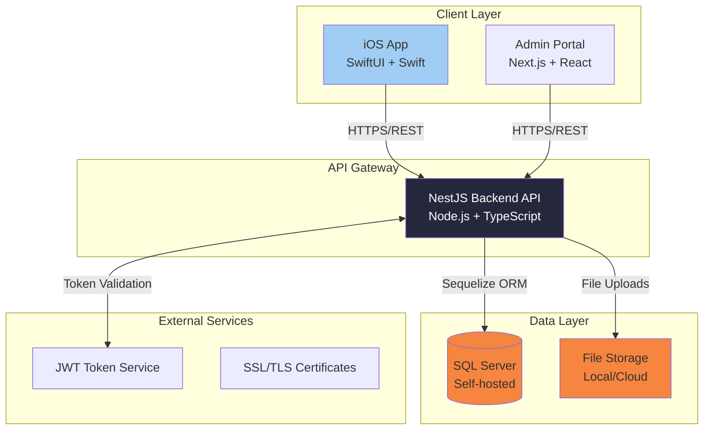
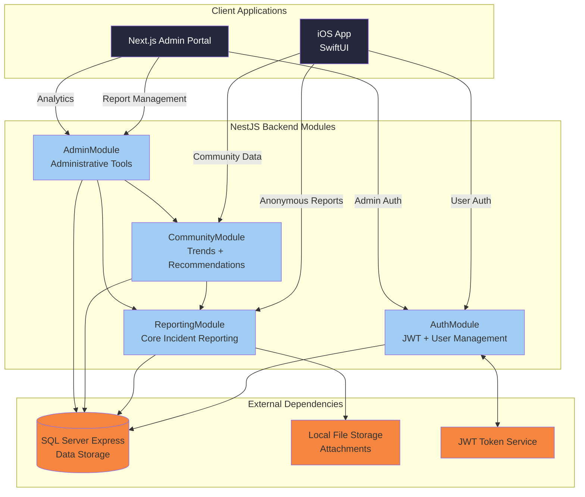
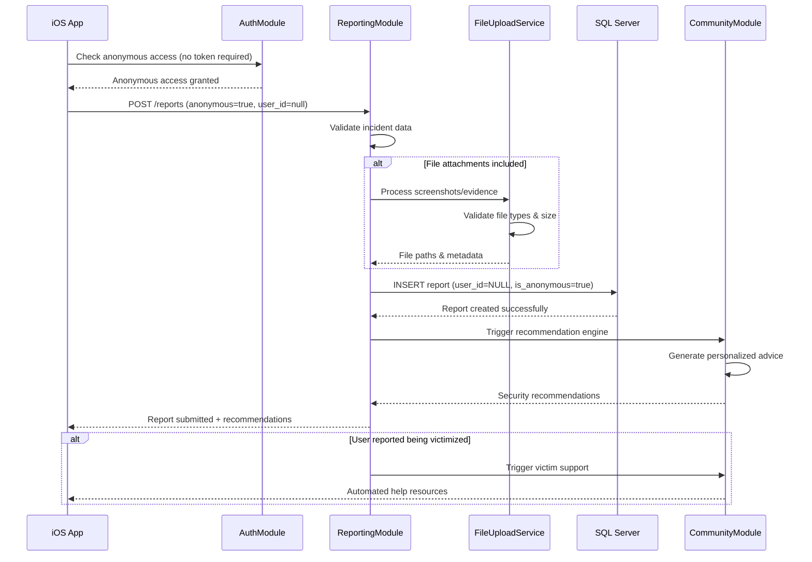
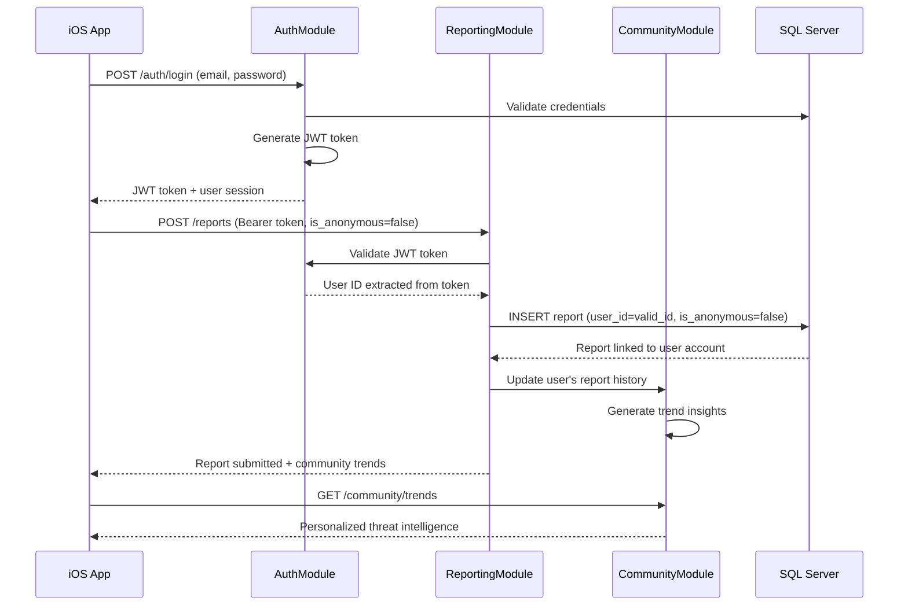
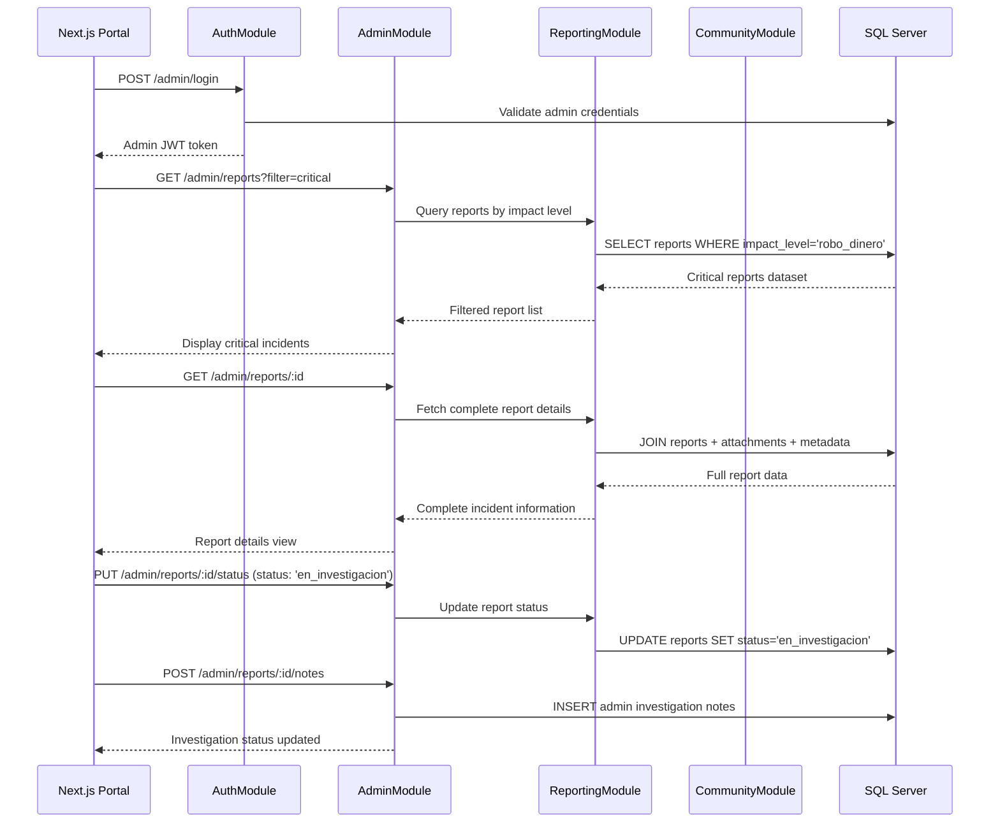

# SafeTrade Architecture Document

## Goals and Background Context

This document outlines the overall project architecture for **SafeTrade**, including backend systems, shared services, and non-UI specific concerns. Its primary goal is to serve as the guiding architectural blueprint for AI-driven development, ensuring consistency and adherence to chosen patterns and technologies.

**Relationship to Frontend Architecture:**
Since SafeTrade includes a significant iOS mobile application, a separate Frontend Architecture Document will detail the frontend-specific design and MUST be used in conjunction with this document. Core technology stack choices documented herein (see "Tech Stack") are definitive for the entire project, including any frontend components.

## Introduction

### Starter Template or Existing Project

**Starter Templates Selected:**
1. **SwiftUI Starter App** - iOS foundation with SwiftUI framework setup
2. **NestJS** - Node.js backend framework (instead of Express mentioned in PRD)  
3. **Next.js** - React framework for admin portal (instead of vanilla React)

**Architecture Impact Analysis:**
- **NestJS vs Express:** NestJS provides enterprise-grade structure with TypeScript, dependency injection, and decorators - excellent for the modular architecture needed for SafeTrade's authentication, reporting, and analytics services
- **Next.js vs React:** Next.js offers SSR/SSG capabilities and better SEO for the admin portal, plus built-in API routes that could supplement the main NestJS backend
- **SwiftUI Starter:** Provides modern iOS development foundation with declarative UI perfect for SafeTrade's mobile-first approach

**Benefits for Academic Project:**
- Faster setup and configuration
- Built-in best practices and project structure
- TypeScript throughout (NestJS + Next.js) for better code quality
- Production-ready foundations for all three major components

### Change Log
| Date | Version | Description | Author |
|------|---------|-------------|---------|
| 2025-09-11 | 1.0 | Initial architecture creation from PRD | Winston (Architect Agent) |

## High Level Architecture

### Technical Summary

SafeTrade employs a **modern three-tier architecture** with native mobile client, enterprise-grade backend API, and web-based administrative interface. The system uses **NestJS microservice-ready monolith** for rapid development with future scaling capabilities, **SQL Server relational database** for structured data integrity, and **JWT-based authentication** supporting both anonymous and identified user flows. Core architectural patterns include **Repository Pattern** for data access, **Service Layer Architecture** for business logic separation, and **Event-Driven Communication** for future extensibility. This architecture directly supports PRD goals by enabling friction-free mobile reporting, community intelligence aggregation, and administrative oversight while maintaining 99.5% uptime and sub-2-second response times.

### High Level Overview

**Architectural Style:** Modular Monolith with Microservice-Ready Design
- Single deployable NestJS backend with clear module boundaries (auth, reporting, analytics, community)
- Internal service separation enables future microservice migration as community scales

**Repository Structure:** Monorepo (from PRD)
- Unified codebase management for iOS app, NestJS backend, and Next.js admin portal
- Shared TypeScript types and utilities across backend and admin frontend

**Service Architecture:** NestJS Monolithic Backend (from PRD decision)
- Faster development and simplified deployment for academic timeline
- Internal module architecture: AuthModule, ReportingModule, AnalyticsModule, CommunityModule

**Primary User Interaction Flow:**
1. **Mobile Entry:** iOS app → Authentication choice (anonymous/registered) → Report submission → Community trends
2. **Data Flow:** Mobile reports → NestJS API → SQL Server → Analytics processing → Community insights
3. **Admin Flow:** Web portal → Report management → Status updates → Analytics dashboard

**Key Architectural Decisions:**
- **NestJS over Express:** Enterprise patterns, TypeScript-first, dependency injection for scalable module architecture
- **Next.js for Admin:** SSR capabilities, built-in optimizations, potential API route supplementation
- **JWT Authentication:** Stateless tokens supporting both anonymous and identified reporting workflows

### High Level Project Diagram



### Architectural and Design Patterns

**Core Patterns Selected:**

- **Modular Monolith Architecture:** NestJS modules (Auth, Reporting, Analytics, Community) with clear boundaries - _Rationale:_ Balances development speed with future scalability, perfect for academic timeline while maintaining enterprise structure

- **Repository Pattern:** Abstract data access through repositories and services - _Rationale:_ Enables testing, database migration flexibility, and clean separation between business logic and data persistence

- **JWT Stateless Authentication:** Token-based authentication with refresh rotation - _Rationale:_ Supports both anonymous and identified user flows, scalable across multiple clients (iOS + web)

- **Event-Driven Notifications:** Internal event system for user actions and report processing - _Rationale:_ Decouples components, enables future real-time features, supports analytics tracking

- **Service Layer Pattern:** Business logic encapsulated in NestJS services - _Rationale:_ Clear separation of concerns, testable business rules, dependency injection support

- **API Gateway Pattern:** Single NestJS backend serving multiple clients - _Rationale:_ Unified API surface, consistent authentication, simplified deployment for academic project

## Tech Stack

### Cloud Infrastructure
- **Provider:** Local/Self-hosted development environment
- **Key Services:** SQL Server Express (local), Let's Encrypt SSL, local file storage
- **Deployment Regions:** Local development, single production deployment

### Technology Stack Table

| Category | Technology | Version | Purpose | Rationale |
|----------|------------|---------|---------|-----------|
| **Language** | TypeScript | 5.2.0 | Primary backend language | Strong typing, excellent tooling, NestJS requirement |
| **Runtime** | Node.js | 18.17.0 LTS | JavaScript runtime | LTS stability, NestJS compatibility, academic reliability |
| **Backend Framework** | NestJS | 10.2.0 | Enterprise API framework | Modular architecture, DI, TypeScript-first, scalable patterns |
| **Database** | SQL Server Express | 2019 | Local development database | Free for academic use, full SQL Server features, 10GB limit sufficient |
| **Database ORM** | Sequelize | 6.32.0 | SQL Server integration | Migration support, TypeScript definitions, query optimization |
| **Authentication** | JWT + bcrypt | jsonwebtoken@9.0.0, bcrypt@5.1.0 | Token-based auth | Stateless sessions, anonymous + identified flows support |
| **iOS Framework** | SwiftUI | iOS 14+ | Native iOS development | Declarative UI, modern iOS patterns, starter template choice |
| **iOS Language** | Swift | 5.8+ | iOS development language | Native performance, type safety, Apple ecosystem integration |
| **Admin Framework** | Next.js | 13.4.0 | React-based admin portal | SSR/SSG capabilities, built-in optimization, starter template choice |
| **Admin Language** | TypeScript | 5.2.0 | Admin portal development | Type safety, consistent with backend, developer productivity |
| **Testing Framework** | Jest + Supertest | jest@29.5.0, supertest@6.3.0 | Backend testing | NestJS integration, API testing, academic project standard |
| **iOS Testing** | XCTest | Built-in | iOS unit testing | Native iOS testing framework, integrated with Xcode |
| **File Upload** | Multer | 1.4.5 | Secure file handling | NestJS compatibility, validation support, local storage |
| **Validation** | class-validator | 0.14.0 | Input validation | Decorator-based validation, TypeScript integration, security focus |
| **Logging** | Winston | 3.9.0 | Application logging | Structured logging, multiple transports, NestJS integration |
| **Development Tools** | ESLint + Prettier | eslint@8.44.0, prettier@3.0.0 | Code quality | Consistent formatting, error prevention, team collaboration |
| **Environment Config** | dotenv | 16.3.0 | Environment variable management | Team configuration consistency, secret management |

### Environment Configuration Strategy

**Local Development Setup:**
- **`.env.example`** - Template file committed to repo with all required variables (no sensitive values)
- **`.env`** - Local environment file (gitignored) each developer creates from template
- **Team shared values** - Database connection strings, API URLs documented in project README
- **Individual secrets** - JWT secrets, admin passwords generated per developer

**Configuration Categories:**
```bash
# Database Configuration
DB_HOST=localhost
DB_PORT=1433
DB_NAME=safetrade_dev
DB_USER=sa
DB_PASSWORD=[individual_password]

# JWT Configuration  
JWT_SECRET=[individual_secret]
JWT_EXPIRES_IN=1h
JWT_REFRESH_SECRET=[individual_refresh_secret]

# File Upload Configuration
UPLOAD_PATH=./uploads
MAX_FILE_SIZE=10485760

# Application Configuration
NODE_ENV=development
PORT=3000
API_PREFIX=api/v1
```

## Data Models

### User Model
**Purpose:** Optional user registration for identified reporting and report history tracking

**Key Attributes:**
- user_id: UUID (Primary Key) - Unique user identifier
- email: string - User email address for authentication
- password_hash: string - bcrypt hashed password
- jwt_token: string (nullable) - Current active session token
- created_at: datetime - Account creation timestamp
- updated_at: datetime - Last account modification timestamp

**Relationships:**
- One-to-Many with Reports (for identified reports only)
- Reports can exist without User (anonymous reporting)

### Report Model  
**Purpose:** Core incident reporting data supporting both anonymous and identified submissions

**Key Attributes:**
- report_id: UUID (Primary Key) - Unique report identifier
- user_id: UUID (Foreign Key, nullable) - Links to User for identified reports, NULL for anonymous
- is_anonymous: boolean - Explicit flag for report type (true = anonymous, false = identified)
- attack_type: enum - ['email', 'SMS', 'whatsapp', 'llamada', 'redes_sociales', 'otro']
- incident_date: date - When the attack occurred
- incident_time: time - Time of attack occurrence
- attack_origin: string - Phone number or email address of attacker
- suspicious_url: string (nullable) - Malicious URL if applicable
- message_content: text (nullable) - Original attack message content
- impact_level: enum - ['ninguno', 'robo_datos', 'robo_dinero', 'cuenta_comprometida']
- description: text - Free-text detailed description
- status: enum - ['nuevo', 'revisado', 'en_investigacion', 'cerrado']
- created_at: datetime - Report submission timestamp
- updated_at: datetime - Last report modification

**Relationships:**
- Many-to-One with User (nullable for anonymous reports)
- One-to-Many with ReportAttachments

### ReportAttachment Model
**Purpose:** File uploads (screenshots, evidence) associated with incident reports

**Key Attributes:**
- attachment_id: UUID (Primary Key) - Unique attachment identifier
- report_id: UUID (Foreign Key) - Links to parent Report
- file_name: string - Original uploaded filename
- file_path: string - Server storage path
- file_size: integer - File size in bytes
- mime_type: string - File type validation
- uploaded_at: datetime - Upload timestamp

**Relationships:**
- Many-to-One with Report

### AdminUser Model
**Purpose:** Administrative portal access for SafeTrade company users

**Key Attributes:**
- admin_id: UUID (Primary Key) - Unique admin identifier
- email: string - Admin email address
- password_hash: string - bcrypt hashed password
- last_login: datetime (nullable) - Last login timestamp
- created_at: datetime - Account creation timestamp

**Relationships:**
- Independent entity (no direct relationships with user reports for privacy)

## Components

### AuthModule
**Responsibility:** Handle all authentication flows including anonymous access, user registration/login, JWT token management, and admin authentication

**Key Interfaces:**
- POST `/auth/register` - User registration endpoint
- POST `/auth/login` - User authentication endpoint  
- POST `/auth/refresh` - JWT token refresh
- POST `/admin/login` - Admin authentication endpoint
- GET `/auth/verify` - Token validation middleware

**Dependencies:** UserService, AdminUserService, JWT utilities, bcrypt hashing

**Technology Stack:** NestJS Guards, JWT Strategy, Passport.js integration, bcrypt password hashing

### ReportingModule  
**Responsibility:** Core incident reporting functionality supporting both anonymous and identified report submissions, file uploads, and report management

**Key Interfaces:**
- POST `/reports` - Submit new incident report (anonymous or identified)
- GET `/reports` - Retrieve reports (admin only, with filtering/pagination)
- GET `/reports/:id` - Get specific report details
- PUT `/reports/:id/status` - Update report status (admin only)
- POST `/reports/:id/attachments` - Upload file attachments

**Dependencies:** ReportService, FileUploadService, ValidationService, AuthModule

**Technology Stack:** Multer file upload, class-validator input validation, Sequelize ORM integration

### CommunityModule
**Responsibility:** Community intelligence features including threat trends analysis, personalized security recommendations, and automated victim support

**Key Interfaces:**
- GET `/community/trends` - Popular attack patterns and trends
- GET `/community/recommendations/:reportId` - Personalized security advice
- GET `/community/support/:reportId` - Victim support resources
- GET `/community/analytics` - Community-level threat analytics

**Dependencies:** ReportingModule, AnalyticsService, RecommendationEngine

**Technology Stack:** Data aggregation queries, caching for performance, recommendation algorithms

### AdminModule
**Responsibility:** Administrative portal functionality including report management, advanced filtering, status updates, and investigation tracking

**Key Interfaces:**
- GET `/admin/dashboard` - Admin dashboard with key metrics
- GET `/admin/reports` - Advanced report search and filtering
- PUT `/admin/reports/:id/notes` - Add investigation notes
- GET `/admin/analytics` - Comprehensive platform analytics
- GET `/admin/exports` - Data export functionality

**Dependencies:** ReportingModule, CommunityModule, AuthModule (admin guards)

**Technology Stack:** Advanced SQL queries, data export utilities, admin-specific Guards

### Component Diagrams



## Core Workflows

### Anonymous Incident Reporting Workflow



### Registered User Identified Reporting Workflow



### Admin Report Investigation Workflow



## REST API Spec

```yaml
openapi: 3.0.0
info:
  title: SafeTrade Cybersecurity Incident Reporting API
  version: 1.0.0
  description: RESTful API for SafeTrade platform supporting anonymous and identified cybersecurity incident reporting with community intelligence features
servers:
  - url: http://localhost:3000/api/v1
    description: Local development server

components:
  securitySchemes:
    BearerAuth:
      type: http
      scheme: bearer
      bearerFormat: JWT
    AdminAuth:
      type: http
      scheme: bearer
      bearerFormat: JWT
      description: Admin-specific JWT token
  
  schemas:
    User:
      type: object
      properties:
        user_id:
          type: string
          format: uuid
        email:
          type: string
          format: email
        created_at:
          type: string
          format: date-time
    
    Report:
      type: object
      properties:
        report_id:
          type: string
          format: uuid
        user_id:
          type: string
          format: uuid
          nullable: true
        is_anonymous:
          type: boolean
        attack_type:
          type: string
          enum: [email, SMS, whatsapp, llamada, redes_sociales, otro]
        incident_date:
          type: string
          format: date
        incident_time:
          type: string
          format: time
        attack_origin:
          type: string
          description: Phone number or email of attacker
        suspicious_url:
          type: string
          format: uri
          nullable: true
        message_content:
          type: string
          nullable: true
        impact_level:
          type: string
          enum: [ninguno, robo_datos, robo_dinero, cuenta_comprometida]
        description:
          type: string
        status:
          type: string
          enum: [nuevo, revisado, en_investigacion, cerrado]
        created_at:
          type: string
          format: date-time
    
    TrendData:
      type: object
      properties:
        attack_type:
          type: string
        count:
          type: integer
        percentage:
          type: number
        time_period:
          type: string

paths:
  # Authentication Endpoints
  /auth/register:
    post:
      tags: [Authentication]
      summary: Register new user account
      requestBody:
        required: true
        content:
          application/json:
            schema:
              type: object
              required: [email, password]
              properties:
                email:
                  type: string
                  format: email
                password:
                  type: string
                  minLength: 8
      responses:
        '201':
          description: User registered successfully
          content:
            application/json:
              schema:
                type: object
                properties:
                  access_token:
                    type: string
                  user:
                    $ref: '#/components/schemas/User'
        '400':
          description: Invalid email or password requirements not met
        '409':
          description: Email already registered
  
  /auth/login:
    post:
      tags: [Authentication]
      summary: User login
      requestBody:
        required: true
        content:
          application/json:
            schema:
              type: object
              required: [email, password]
              properties:
                email:
                  type: string
                  format: email
                password:
                  type: string
      responses:
        '200':
          description: Login successful
          content:
            application/json:
              schema:
                type: object
                properties:
                  access_token:
                    type: string
                  refresh_token:
                    type: string
                  user:
                    $ref: '#/components/schemas/User'
        '401':
          description: Invalid credentials

  # Incident Reporting Endpoints
  /reports:
    post:
      tags: [Reporting]
      summary: Submit incident report (anonymous or identified)
      security:
        - BearerAuth: []
        - {} # Anonymous access allowed
      requestBody:
        required: true
        content:
          multipart/form-data:
            schema:
              type: object
              required: [attack_type, incident_date, attack_origin, impact_level]
              properties:
                is_anonymous:
                  type: boolean
                  default: true
                attack_type:
                  type: string
                  enum: [email, SMS, whatsapp, llamada, redes_sociales, otro]
                incident_date:
                  type: string
                  format: date
                incident_time:
                  type: string
                  format: time
                attack_origin:
                  type: string
                suspicious_url:
                  type: string
                  format: uri
                message_content:
                  type: string
                impact_level:
                  type: string
                  enum: [ninguno, robo_datos, robo_dinero, cuenta_comprometida]
                description:
                  type: string
                attachments:
                  type: array
                  items:
                    type: string
                    format: binary
      responses:
        '201':
          description: Report submitted successfully
          content:
            application/json:
              schema:
                type: object
                properties:
                  report:
                    $ref: '#/components/schemas/Report'
                  recommendations:
                    type: array
                    items:
                      type: string
                  victim_support:
                    type: object
                    nullable: true
        '400':
          description: Invalid report data or file upload error
    
    get:
      tags: [Reporting]
      summary: Get reports (admin only)
      security:
        - AdminAuth: []
      parameters:
        - name: status
          in: query
          schema:
            type: string
            enum: [nuevo, revisado, en_investigacion, cerrado]
        - name: attack_type
          in: query
          schema:
            type: string
        - name: impact_level
          in: query
          schema:
            type: string
        - name: date_from
          in: query
          schema:
            type: string
            format: date
        - name: date_to
          in: query
          schema:
            type: string
            format: date
        - name: page
          in: query
          schema:
            type: integer
            default: 1
        - name: limit
          in: query
          schema:
            type: integer
            default: 20
      responses:
        '200':
          description: Paginated list of reports
          content:
            application/json:
              schema:
                type: object
                properties:
                  reports:
                    type: array
                    items:
                      $ref: '#/components/schemas/Report'
                  pagination:
                    type: object
                    properties:
                      total:
                        type: integer
                      page:
                        type: integer
                      pages:
                        type: integer
        '401':
          description: Admin authentication required

  # Community Intelligence Endpoints
  /community/trends:
    get:
      tags: [Community]
      summary: Get community threat trends
      parameters:
        - name: period
          in: query
          schema:
            type: string
            enum: [7days, 30days, 90days]
            default: 30days
        - name: region
          in: query
          schema:
            type: string
      responses:
        '200':
          description: Community threat trends data
          content:
            application/json:
              schema:
                type: object
                properties:
                  trends:
                    type: array
                    items:
                      $ref: '#/components/schemas/TrendData'
                  total_reports:
                    type: integer
                  period:
                    type: string
  
  /community/recommendations/{reportId}:
    get:
      tags: [Community]
      summary: Get personalized security recommendations
      parameters:
        - name: reportId
          in: path
          required: true
          schema:
            type: string
            format: uuid
      responses:
        '200':
          description: Personalized security recommendations
          content:
            application/json:
              schema:
                type: object
                properties:
                  recommendations:
                    type: array
                    items:
                      type: object
                      properties:
                        title:
                          type: string
                        content:
                          type: string
                        priority:
                          type: string
                          enum: [alta, media, baja]

  # Admin Management Endpoints
  /admin/login:
    post:
      tags: [Admin]
      summary: Admin authentication
      requestBody:
        required: true
        content:
          application/json:
            schema:
              type: object
              required: [email, password]
              properties:
                email:
                  type: string
                  format: email
                password:
                  type: string
      responses:
        '200':
          description: Admin login successful
          content:
            application/json:
              schema:
                type: object
                properties:
                  access_token:
                    type: string
                  admin_id:
                    type: string
                    format: uuid
        '401':
          description: Invalid admin credentials

  /admin/dashboard:
    get:
      tags: [Admin]
      summary: Admin dashboard metrics
      security:
        - AdminAuth: []
      responses:
        '200':
          description: Dashboard statistics
          content:
            application/json:
              schema:
                type: object
                properties:
                  total_reports:
                    type: integer
                  reports_today:
                    type: integer
                  critical_reports:
                    type: integer
                  recent_trends:
                    type: array
                    items:
                      $ref: '#/components/schemas/TrendData'

  /admin/reports/{reportId}/status:
    put:
      tags: [Admin]
      summary: Update report status
      security:
        - AdminAuth: []
      parameters:
        - name: reportId
          in: path
          required: true
          schema:
            type: string
            format: uuid
      requestBody:
        required: true
        content:
          application/json:
            schema:
              type: object
              required: [status]
              properties:
                status:
                  type: string
                  enum: [nuevo, revisado, en_investigacion, cerrado]
                notes:
                  type: string
      responses:
        '200':
          description: Report status updated
        '404':
          description: Report not found
        '401':
          description: Admin authentication required
```

## Database Schema

```sql
-- SafeTrade Database Schema for SQL Server Express
-- Academic Project - Optimized for <10GB limit

-- Users Table (Optional Registration)
CREATE TABLE Users (
    user_id UNIQUEIDENTIFIER PRIMARY KEY DEFAULT NEWID(),
    email NVARCHAR(255) UNIQUE NOT NULL,
    password_hash NVARCHAR(255) NOT NULL,
    jwt_token NVARCHAR(500) NULL, -- Current session token
    created_at DATETIME2 DEFAULT GETUTCDATE(),
    updated_at DATETIME2 DEFAULT GETUTCDATE(),
    
    -- Indexes for performance
    INDEX IX_Users_Email (email),
    INDEX IX_Users_JwtToken (jwt_token)
);

-- Reports Table (Core Incident Data)
CREATE TABLE Reports (
    report_id UNIQUEIDENTIFIER PRIMARY KEY DEFAULT NEWID(),
    user_id UNIQUEIDENTIFIER NULL, -- NULL for anonymous reports
    is_anonymous BIT NOT NULL DEFAULT 1, -- Explicit anonymous flag
    
    -- Attack Details
    attack_type NVARCHAR(20) NOT NULL 
        CHECK (attack_type IN ('email', 'SMS', 'whatsapp', 'llamada', 'redes_sociales', 'otro')),
    incident_date DATE NOT NULL,
    incident_time TIME NULL,
    attack_origin NVARCHAR(255) NOT NULL, -- Phone/email of attacker
    
    -- Optional Evidence
    suspicious_url NVARCHAR(2048) NULL,
    message_content NTEXT NULL, -- Original attack message
    description NTEXT NULL, -- Free-text description
    
    -- Impact Assessment
    impact_level NVARCHAR(30) NOT NULL 
        CHECK (impact_level IN ('ninguno', 'robo_datos', 'robo_dinero', 'cuenta_comprometida')),
    
    -- Administrative
    status NVARCHAR(20) NOT NULL DEFAULT 'nuevo'
        CHECK (status IN ('nuevo', 'revisado', 'en_investigacion', 'cerrado')),
    admin_notes NTEXT NULL, -- Investigation notes
    
    -- Timestamps
    created_at DATETIME2 DEFAULT GETUTCDATE(),
    updated_at DATETIME2 DEFAULT GETUTCDATE(),
    
    -- Foreign Key (nullable for anonymous)
    FOREIGN KEY (user_id) REFERENCES Users(user_id) ON DELETE SET NULL,
    
    -- Performance Indexes
    INDEX IX_Reports_AttackType (attack_type),
    INDEX IX_Reports_IncidentDate (incident_date),
    INDEX IX_Reports_Status (status),
    INDEX IX_Reports_ImpactLevel (impact_level),
    INDEX IX_Reports_Anonymous (is_anonymous),
    INDEX IX_Reports_UserId (user_id), -- For user report history
    INDEX IX_Reports_CreatedAt (created_at) -- For trends analysis
);

-- Report Attachments (File Uploads)
CREATE TABLE ReportAttachments (
    attachment_id UNIQUEIDENTIFIER PRIMARY KEY DEFAULT NEWID(),
    report_id UNIQUEIDENTIFIER NOT NULL,
    
    -- File Information
    file_name NVARCHAR(255) NOT NULL,
    original_name NVARCHAR(255) NOT NULL, -- User's original filename
    file_path NVARCHAR(500) NOT NULL, -- Server storage path
    file_size BIGINT NOT NULL, -- Size in bytes
    mime_type NVARCHAR(100) NOT NULL, -- Content type validation
    
    -- Security
    file_hash NVARCHAR(64) NULL, -- SHA-256 for integrity
    scan_status NVARCHAR(20) DEFAULT 'pending' -- For malware scanning
        CHECK (scan_status IN ('pending', 'clean', 'quarantined')),
    
    uploaded_at DATETIME2 DEFAULT GETUTCDATE(),
    
    FOREIGN KEY (report_id) REFERENCES Reports(report_id) ON DELETE CASCADE,
    
    -- Performance Index
    INDEX IX_Attachments_ReportId (report_id)
);

-- Admin Users (Separate from regular users)
CREATE TABLE AdminUsers (
    admin_id UNIQUEIDENTIFIER PRIMARY KEY DEFAULT NEWID(),
    email NVARCHAR(255) UNIQUE NOT NULL,
    password_hash NVARCHAR(255) NOT NULL,
    
    -- Admin Metadata
    role NVARCHAR(50) DEFAULT 'admin' -- Future role expansion
        CHECK (role IN ('admin', 'super_admin')),
    is_active BIT DEFAULT 1,
    last_login DATETIME2 NULL,
    
    created_at DATETIME2 DEFAULT GETUTCDATE(),
    
    INDEX IX_AdminUsers_Email (email),
    INDEX IX_AdminUsers_Active (is_active)
);

-- Community Analytics Cache (Performance Optimization)
CREATE TABLE CommunityTrends (
    trend_id UNIQUEIDENTIFIER PRIMARY KEY DEFAULT NEWID(),
    
    -- Trend Data
    attack_type NVARCHAR(20) NOT NULL,
    time_period NVARCHAR(10) NOT NULL -- '7days', '30days', '90days'
        CHECK (time_period IN ('7days', '30days', '90days')),
    region NVARCHAR(100) NULL, -- For future regional analysis
    
    -- Calculated Statistics
    report_count INT NOT NULL,
    percentage DECIMAL(5,2) NOT NULL,
    trend_direction NVARCHAR(10) NULL -- 'increasing', 'decreasing', 'stable'
        CHECK (trend_direction IN ('increasing', 'decreasing', 'stable')),
    
    -- Cache Management
    calculated_at DATETIME2 DEFAULT GETUTCDATE(),
    expires_at DATETIME2 NOT NULL, -- TTL for cache invalidation
    
    -- Performance Indexes
    INDEX IX_Trends_Period_Type (time_period, attack_type),
    INDEX IX_Trends_Expiry (expires_at)
);

-- Trigger for automatic updated_at timestamps
CREATE TRIGGER TR_Users_UpdatedAt ON Users
    AFTER UPDATE
AS
BEGIN
    UPDATE Users 
    SET updated_at = GETUTCDATE()
    WHERE user_id IN (SELECT user_id FROM inserted);
END;

CREATE TRIGGER TR_Reports_UpdatedAt ON Reports
    AFTER UPDATE
AS
BEGIN
    UPDATE Reports 
    SET updated_at = GETUTCDATE()
    WHERE report_id IN (SELECT report_id FROM inserted);
END;

-- Views for Common Queries

-- Anonymous Reports View (Privacy Protection)
CREATE VIEW AnonymousReports AS
SELECT 
    report_id,
    attack_type,
    incident_date,
    impact_level,
    status,
    created_at
FROM Reports
WHERE is_anonymous = 1;

-- User Report History View (Identified Reports Only)
CREATE VIEW UserReportHistory AS
SELECT 
    r.report_id,
    r.user_id,
    r.attack_type,
    r.incident_date,
    r.impact_level,
    r.status,
    r.created_at,
    COUNT(a.attachment_id) as attachment_count
FROM Reports r
LEFT JOIN ReportAttachments a ON r.report_id = a.report_id
WHERE r.is_anonymous = 0 AND r.user_id IS NOT NULL
GROUP BY r.report_id, r.user_id, r.attack_type, r.incident_date, 
         r.impact_level, r.status, r.created_at;

-- Admin Dashboard Summary View
CREATE VIEW AdminDashboard AS
SELECT 
    COUNT(*) as total_reports,
    COUNT(CASE WHEN created_at >= CAST(GETDATE() AS DATE) THEN 1 END) as reports_today,
    COUNT(CASE WHEN impact_level IN ('robo_dinero', 'robo_datos') THEN 1 END) as critical_reports,
    COUNT(CASE WHEN status = 'nuevo' THEN 1 END) as pending_review
FROM Reports;
```

## Source Tree

```
safetrade-monorepo/
├── packages/
│   ├── backend/                           # NestJS API Server
│   │   ├── src/
│   │   │   ├── auth/                      # AuthModule
│   │   │   │   ├── auth.controller.ts     # Login/register endpoints
│   │   │   │   ├── auth.service.ts        # JWT token logic
│   │   │   │   ├── auth.module.ts         # Module definition
│   │   │   │   ├── guards/                # JWT guards
│   │   │   │   │   ├── jwt-auth.guard.ts
│   │   │   │   │   ├── admin.guard.ts
│   │   │   │   │   └── anonymous.guard.ts
│   │   │   │   ├── strategies/            # Passport strategies
│   │   │   │   │   ├── jwt.strategy.ts
│   │   │   │   │   └── admin-jwt.strategy.ts
│   │   │   │   └── dto/                   # Data transfer objects
│   │   │   │       ├── login.dto.ts
│   │   │   │       └── register.dto.ts
│   │   │   ├── reporting/                 # ReportingModule
│   │   │   │   ├── reporting.controller.ts
│   │   │   │   ├── reporting.service.ts
│   │   │   │   ├── reporting.module.ts
│   │   │   │   ├── dto/
│   │   │   │   │   ├── create-report.dto.ts
│   │   │   │   │   └── update-status.dto.ts
│   │   │   │   ├── entities/              # Sequelize models
│   │   │   │   │   ├── report.entity.ts
│   │   │   │   │   └── report-attachment.entity.ts
│   │   │   │   └── services/
│   │   │   │       ├── file-upload.service.ts
│   │   │   │       └── validation.service.ts
│   │   │   ├── community/                 # CommunityModule
│   │   │   │   ├── community.controller.ts
│   │   │   │   ├── community.service.ts
│   │   │   │   ├── community.module.ts
│   │   │   │   ├── services/
│   │   │   │   │   ├── trends.service.ts
│   │   │   │   │   ├── recommendations.service.ts
│   │   │   │   │   └── analytics.service.ts
│   │   │   │   └── entities/
│   │   │   │       └── community-trends.entity.ts
│   │   │   ├── admin/                     # AdminModule
│   │   │   │   ├── admin.controller.ts
│   │   │   │   ├── admin.service.ts
│   │   │   │   ├── admin.module.ts
│   │   │   │   ├── entities/
│   │   │   │   │   └── admin-user.entity.ts
│   │   │   │   └── dto/
│   │   │   │       ├── admin-login.dto.ts
│   │   │   │       └── report-filter.dto.ts
│   │   │   ├── shared/                    # Shared utilities
│   │   │   │   ├── database/
│   │   │   │   │   ├── database.module.ts
│   │   │   │   │   └── database.config.ts
│   │   │   │   ├── config/
│   │   │   │   │   ├── app.config.ts
│   │   │   │   │   └── jwt.config.ts
│   │   │   │   ├── interceptors/
│   │   │   │   │   ├── logging.interceptor.ts
│   │   │   │   │   └── response.interceptor.ts
│   │   │   │   ├── pipes/
│   │   │   │   │   └── validation.pipe.ts
│   │   │   │   └── utils/
│   │   │   │       ├── file-upload.utils.ts
│   │   │   │       └── crypto.utils.ts
│   │   │   ├── app.module.ts              # Root NestJS module
│   │   │   ├── app.controller.ts
│   │   │   └── main.ts                    # Application entry point
│   │   ├── test/                          # E2E tests
│   │   │   ├── auth.e2e-spec.ts
│   │   │   ├── reporting.e2e-spec.ts
│   │   │   └── jest-e2e.json
│   │   ├── uploads/                       # File upload storage
│   │   │   ├── reports/                   # Report attachments
│   │   │   └── temp/                      # Temporary upload processing
│   │   ├── database/
│   │   │   ├── migrations/                # Sequelize migrations
│   │   │   │   ├── 001-create-users.js
│   │   │   │   ├── 002-create-reports.js
│   │   │   │   ├── 003-create-attachments.js
│   │   │   │   └── 004-create-admin-users.js
│   │   │   └── seeders/                   # Development test data
│   │   │       ├── admin-users.js
│   │   │       └── sample-reports.js
│   │   ├── .env.example                   # Environment template
│   │   ├── .env                          # Local environment (gitignored)
│   │   ├── package.json
│   │   ├── tsconfig.json
│   │   ├── nest-cli.json
│   │   └── README.md
│   │
│   ├── mobile/                           # iOS SwiftUI Application
│   │   ├── SafeTrade.xcodeproj/          # Xcode project
│   │   ├── SafeTrade/
│   │   │   ├── App/                      # App lifecycle
│   │   │   │   ├── SafeTradeApp.swift
│   │   │   │   ├── ContentView.swift
│   │   │   │   └── AppDelegate.swift
│   │   │   ├── Views/                    # SwiftUI Views
│   │   │   │   ├── Auth/
│   │   │   │   │   ├── LoginView.swift
│   │   │   │   │   ├── RegisterView.swift
│   │   │   │   │   └── AnonymousChoiceView.swift
│   │   │   │   ├── Reporting/
│   │   │   │   │   ├── ReportFormView.swift
│   │   │   │   │   ├── AttachmentUploadView.swift
│   │   │   │   │   └── ReportConfirmationView.swift
│   │   │   │   ├── Community/
│   │   │   │   │   ├── TrendsView.swift
│   │   │   │   │   ├── RecommendationsView.swift
│   │   │   │   │   └── CommunityFeedView.swift
│   │   │   │   └── Profile/
│   │   │   │       ├── ProfileView.swift
│   │   │   │       └── ReportHistoryView.swift
│   │   │   ├── Models/                   # Data models
│   │   │   │   ├── User.swift
│   │   │   │   ├── Report.swift
│   │   │   │   ├── TrendData.swift
│   │   │   │   └── AuthResponse.swift
│   │   │   ├── Services/                 # API communication
│   │   │   │   ├── APIService.swift
│   │   │   │   ├── AuthService.swift
│   │   │   │   ├── ReportingService.swift
│   │   │   │   └── CommunityService.swift
│   │   │   ├── ViewModels/              # MVVM pattern
│   │   │   │   ├── AuthViewModel.swift
│   │   │   │   ├── ReportingViewModel.swift
│   │   │   │   └── CommunityViewModel.swift
│   │   │   ├── Utils/                   # Utilities
│   │   │   │   ├── Constants.swift
│   │   │   │   ├── Extensions.swift
│   │   │   │   └── NetworkManager.swift
│   │   │   └── Resources/               # Assets
│   │   │       ├── Assets.xcassets/
│   │   │       ├── Colors.xcassets/
│   │   │       └── Localizable.strings  # Spanish localization
│   │   ├── SafeTradeTests/              # Unit tests
│   │   │   ├── AuthTests.swift
│   │   │   ├── ReportingTests.swift
│   │   │   └── CommunityTests.swift
│   │   └── README.md
│   │
│   └── admin-portal/                     # Next.js Admin Web Interface
│       ├── src/
│       │   ├── app/                      # App Router (Next.js 13+)
│       │   │   ├── login/
│       │   │   │   └── page.tsx
│       │   │   ├── dashboard/
│       │   │   │   └── page.tsx
│       │   │   ├── reports/
│       │   │   │   ├── page.tsx
│       │   │   │   └── [id]/
│       │   │   │       └── page.tsx
│       │   │   ├── analytics/
│       │   │   │   └── page.tsx
│       │   │   ├── layout.tsx
│       │   │   └── page.tsx
│       │   ├── components/               # React components
│       │   │   ├── auth/
│       │   │   │   └── LoginForm.tsx
│       │   │   ├── dashboard/
│       │   │   │   ├── MetricsCard.tsx
│       │   │   │   └── RecentReports.tsx
│       │   │   ├── reports/
│       │   │   │   ├── ReportsList.tsx
│       │   │   │   ├── ReportDetails.tsx
│       │   │   │   ├── StatusUpdate.tsx
│       │   │   │   └── SearchFilter.tsx
│       │   │   ├── analytics/
│       │   │   │   ├── TrendChart.tsx
│       │   │   │   └── AttackTypeChart.tsx
│       │   │   └── shared/
│       │   │       ├── Layout.tsx
│       │   │       ├── Navigation.tsx
│       │   │       └── LoadingSpinner.tsx
│       │   ├── lib/                     # Utilities
│       │   │   ├── api.ts              # API client
│       │   │   ├── auth.ts             # Auth utilities
│       │   │   └── utils.ts
│       │   ├── types/                  # TypeScript types
│       │   │   ├── Report.ts
│       │   │   ├── User.ts
│       │   │   └── Analytics.ts
│       │   └── styles/                 # CSS styles
│       │       ├── globals.css
│       │       └── components.css
│       ├── public/                     # Static assets
│       ├── .env.local.example
│       ├── .env.local                 # Local environment (gitignored)
│       ├── package.json
│       ├── tsconfig.json
│       ├── tailwind.config.js         # CSS framework
│       ├── next.config.js
│       └── README.md
│
├── shared/                            # Shared Types and Utilities
│   ├── types/                         # TypeScript definitions
│   │   ├── api-responses.ts          # Common API response types
│   │   ├── report.types.ts           # Report-related types
│   │   └── auth.types.ts             # Authentication types
│   ├── constants/                    # Shared constants
│   │   ├── attack-types.ts
│   │   ├── impact-levels.ts
│   │   └── api-endpoints.ts
│   └── utils/                        # Common utilities
│       ├── validation.ts
│       └── date-utils.ts
│
├── scripts/                          # Monorepo management
│   ├── setup.sh                     # Initial project setup
│   ├── dev.sh                       # Start all development servers
│   ├── build.sh                     # Build all packages
│   └── test.sh                      # Run all tests
│
├── docs/                            # Project documentation
│   ├── api/                         # API documentation
│   │   └── openapi.yaml
│   ├── architecture.md              # This document
│   ├── prd.md                       # Product requirements
│   └── setup-guide.md               # Development setup
│
├── .gitignore                       # Git ignore patterns
├── package.json                     # Root package.json (workspaces)
├── lerna.json                       # Monorepo configuration
├── README.md                        # Project overview
└── LICENSE
```

## Infrastructure and Deployment

### Infrastructure as Code
- **Tool:** Docker Compose 2.21.0 (for local development containerization)
- **Location:** `docker/docker-compose.yml` (in project root)
- **Approach:** Local containerization for consistent development environments across team members

### Deployment Strategy
- **Strategy:** Local Development with Docker Compose
- **Primary Environment:** Individual developer machines with shared database container
- **Presentation Deployment:** Simple production build for final academic presentation
- **Pipeline Configuration:** Manual build processes documented in `scripts/` directory

### Environments

- **Development:** Local machine with Docker containers - Individual developer environments with shared SQL Server container and local file storage
- **Testing:** Local testing environment - Same as development but with test database and mock external services  
- **Demo:** Academic presentation environment - Production builds running locally for demonstration and evaluation purposes

### Environment Promotion Flow

```
Individual Development
    ↓ (manual testing)
Local Testing Environment
    ↓ (team integration)
Team Integration Testing
    ↓ (academic milestone)
Demo/Presentation Build
```

### Rollback Strategy
- **Primary Method:** Git version control with tagged releases
- **Trigger Conditions:** Failed integration testing, breaking changes, database corruption
- **Recovery Time Objective:** 15 minutes (restore from git tag + rebuild containers)

## Error Handling Strategy

### General Approach
- **Error Model:** NestJS Exception Filters with structured error responses and Spanish localization
- **Exception Hierarchy:** Built-in HTTP exceptions extended with custom business logic exceptions
- **Error Propagation:** Centralized error handling with consistent API responses and proper HTTP status codes

### Logging Standards
- **Library:** Winston 3.9.0 with structured JSON logging and multiple transports
- **Format:** JSON structured logs with timestamp, level, message, and contextual metadata
- **Levels:** ERROR (system failures), WARN (recoverable issues), INFO (user actions), DEBUG (development only)
- **Required Context:**
  - Correlation ID: UUID v4 format generated per request for request tracing
  - Service Context: Module name, controller, method for debugging location
  - User Context: Anonymized user identifier or 'anonymous' for privacy compliance

### Error Handling Patterns

#### External API Errors
- **Retry Policy:** Exponential backoff (1s, 2s, 4s) with maximum 3 attempts for transient failures
- **Circuit Breaker:** Open circuit after 5 consecutive failures, half-open retry after 30 seconds
- **Timeout Configuration:** 5 second timeout for API calls, 10 seconds for file operations
- **Error Translation:** Map external service errors to SafeTrade business exceptions with Spanish messages

#### Business Logic Errors
- **Custom Exceptions:** SafeTradeException, InvalidReportException, UnauthorizedAccessException with Spanish error messages
- **User-Facing Errors:** Structured response format with actionable guidance and Spanish localization
- **Error Codes:** Hierarchical error code system (AUTH_001, REPORT_002) for precise error identification

#### Data Consistency
- **Transaction Strategy:** Database transactions for multi-table operations with automatic rollback on failures
- **Compensation Logic:** Saga pattern for file uploads - rollback file storage if database save fails
- **Idempotency:** UUID-based operation keys for report submissions to prevent duplicate entries

## Coding Standards

**IMPORTANT NOTE:** These standards are MANDATORY for AI agents and directly control code generation behavior. They focus on project-specific conventions and critical rules to prevent bad code, assuming AI knows general best practices.

### Core Standards
- **Languages & Runtimes:** TypeScript 5.2.0 for backend/admin, Swift 5.8+ for iOS - strict typing enabled, no `any` types except for third-party integration
- **Style & Linting:** ESLint 8.44.0 + Prettier 3.0.0 for TS/JS code, SwiftLint for iOS - automatic formatting on save required
- **Test Organization:** `*.spec.ts` for unit tests alongside source files, `*.e2e-spec.ts` in test/ directory, `*Tests.swift` in iOS test targets

### Naming Conventions

| Element | Convention | Example |
|---------|------------|---------|
| API Endpoints | Spanish resources, kebab-case | `/reportes`, `/tendencias-comunidad` |
| Database Tables | PascalCase, English | `Reports`, `ReportAttachments` |
| TypeScript Classes | PascalCase | `ReportingService`, `AuthController` |
| TypeScript Methods | camelCase | `createReport()`, `validateToken()` |
| Swift Classes/Structs | PascalCase | `ReportViewModel`, `AuthService` |
| Swift Properties | camelCase | `reportId`, `attackType` |
| Environment Variables | UPPER_SNAKE_CASE | `DB_PASSWORD`, `JWT_SECRET` |

### Critical Rules

- **Spanish Error Messages Only:** All user-facing error messages MUST be in Spanish - never return English error text to mobile or admin interfaces
- **Anonymous Report Privacy:** NEVER log user_id, email, or personal data for reports where is_anonymous=true - use 'anonymous' placeholder in logs
- **JWT Token Validation:** ALL protected endpoints MUST validate JWT tokens before processing - use NestJS Guards, never implement custom validation logic
- **File Upload Security:** NEVER accept file uploads without MIME type validation and size limits - use Multer configuration with strict file type checking
- **Database Transactions:** ALL multi-table operations MUST use database transactions - report creation with attachments requires transaction wrapper
- **Input Validation:** NEVER trust client input - use class-validator decorators on all DTOs with Spanish error messages
- **Password Handling:** NEVER store plain text passwords - use bcrypt with salt rounds >= 12 for all password operations
- **SQL Injection Prevention:** NEVER use raw SQL queries - use Sequelize ORM with parameterized queries only
- **CORS Configuration:** NEVER use wildcard CORS in production - specify exact origins for iOS app and admin portal
- **Environment Variables:** NEVER commit .env files or hardcode secrets - use .env.example templates with placeholder values

### Language-Specific Guidelines

#### TypeScript Specifics
- **Strict Mode:** Enable all TypeScript strict flags - noImplicitAny, strictNullChecks, strictFunctionTypes
- **Import Organization:** Use absolute imports with path mapping - `@/shared/utils` instead of relative paths
- **Error Handling:** Use Result<T, E> pattern for operations that can fail - avoid throwing exceptions in business logic
- **Type Definitions:** Create shared types in `/shared/types` - never duplicate type definitions across packages

#### Swift Specifics  
- **SwiftUI Patterns:** Use @StateObject for view model ownership, @ObservedObject for passed dependencies
- **Async/Await:** Use structured concurrency - avoid completion handlers for new code
- **Error Handling:** Use Result<Success, Failure> and do-try-catch patterns - throw descriptive errors with Spanish messages
- **Memory Management:** Use weak references for delegates and closures to prevent retain cycles

## Test Strategy and Standards

### Testing Philosophy
- **Approach:** Test-After Development (TAD) with emphasis on critical business logic and API endpoint coverage
- **Coverage Goals:** 80% unit test coverage for services and controllers, 90% coverage for authentication and security modules
- **Test Pyramid:** 70% unit tests, 25% integration tests, 5% end-to-end tests optimized for academic timeline constraints

### Test Types and Organization

#### Unit Tests
- **Framework:** Jest 29.5.0 with @nestjs/testing utilities for dependency injection testing
- **File Convention:** `*.spec.ts` files alongside source code (e.g., `auth.service.spec.ts` next to `auth.service.ts`)
- **Location:** Same directory as source files for easy navigation and maintenance
- **Mocking Library:** Jest built-in mocking with custom factory functions for SafeTrade entities
- **Coverage Requirement:** 80% minimum line coverage, 90% for critical security modules

**AI Agent Requirements:**
- Generate tests for all public methods in services and controllers
- Cover edge cases and error conditions (invalid JWT tokens, malformed report data, file upload failures)
- Follow AAA pattern (Arrange, Act, Assert) with descriptive test names in English
- Mock all external dependencies (database, file system, external APIs)

#### Integration Tests
- **Scope:** API endpoint testing with real database connections and file upload handling
- **Location:** `test/` directory in backend package with descriptive filenames
- **Test Infrastructure:**
  - **Database:** In-memory SQLite for fast test execution, or Docker SQL Server container for production-like testing
  - **File Storage:** Temporary directory with automatic cleanup after test completion
  - **Authentication:** Test JWT tokens generated with known secrets for consistent testing

#### End-to-End Tests
- **Framework:** Detox for iOS end-to-end testing with device simulators
- **Scope:** Critical user journeys - anonymous reporting, user registration/login, community trends viewing
- **Environment:** iOS Simulator with backend running in Docker container for realistic testing
- **Test Data:** Seeded database with predictable test scenarios and clean state between tests

### Test Data Management
- **Strategy:** Factory pattern for generating test entities with realistic Spanish content
- **Fixtures:** Predefined test files (sample screenshots, malicious URLs) in `test/fixtures/` directory
- **Factories:** TypeScript factory functions creating consistent test data across unit and integration tests
- **Cleanup:** Automatic database reset and file cleanup between test runs to prevent test contamination

### Continuous Testing
- **CI Integration:** Manual testing process for academic project - automated testing deferred to post-MVP
- **Performance Tests:** Simple load testing with artillery.js to verify <2s response time requirements
- **Security Tests:** Manual security testing checklist focusing on JWT validation, file upload security, and SQL injection prevention

## Security

**MANDATORY security requirements for AI and human developers - these rules directly impact code generation and implementation decisions.**

### Input Validation
- **Validation Library:** class-validator 0.14.0 with Spanish error messages for consistent user experience
- **Validation Location:** All validation at API boundary before business logic processing - never trust client input
- **Required Rules:**
  - All external inputs MUST be validated using class-validator decorators on DTOs
  - Validation at API boundary before processing - implement validation pipes in NestJS controllers
  - Whitelist approach preferred over blacklist - explicitly allow known good inputs rather than blocking known bad

### Authentication & Authorization
- **Auth Method:** JWT-based stateless authentication with bcrypt password hashing and refresh token rotation
- **Session Management:** Stateless JWT tokens with 1-hour expiry and refresh token system for extended sessions
- **Required Patterns:**
  - NEVER store passwords in plain text - use bcrypt with minimum 12 salt rounds
  - ALL protected endpoints MUST validate JWT tokens using NestJS Guards before processing
  - Triple authentication support: anonymous access, user JWT tokens, admin JWT tokens with role-based access

### Secrets Management
- **Development:** .env files with individual secrets per developer - never commit secrets to repository
- **Production:** Environment variables injected at runtime - no hardcoded secrets in codebase
- **Code Requirements:**
  - NEVER hardcode secrets, API keys, or sensitive configuration in source code
  - Access via configuration service only - use NestJS ConfigModule with validation
  - No secrets in logs or error messages - sanitize all logging output

### API Security
- **Rate Limiting:** 100 requests per minute per IP address using @nestjs/throttler to prevent abuse
- **CORS Policy:** Restrictive CORS allowing only iOS app and admin portal origins - never use wildcard in production
- **Security Headers:** Helmet.js middleware for security headers including CSP, HSTS, and X-Frame-Options
- **HTTPS Enforcement:** All connections must use HTTPS in production - redirect HTTP to HTTPS automatically

### Data Protection
- **Encryption at Rest:** SQL Server Transparent Data Encryption (TDE) for database files
- **Encryption in Transit:** HTTPS/TLS 1.3 for all API communication with automatic certificate renewal
- **PII Handling:** Anonymous reports must never log or expose personal identifiers - use 'anonymous' placeholder
- **Logging Restrictions:** Never log passwords, JWT tokens, personal data, or sensitive business information

### Dependency Security
- **Scanning Tool:** npm audit for vulnerability scanning with monthly dependency updates
- **Update Policy:** Monthly security updates for dependencies - immediate updates for critical vulnerabilities
- **Approval Process:** Review all new dependencies for security reputation and maintenance status

### Security Testing
- **SAST Tool:** ESLint security rules and SonarQube for static analysis of security vulnerabilities
- **DAST Tool:** Manual security testing checklist for SQL injection, XSS, and authentication bypass
- **Penetration Testing:** Academic security assessment focusing on JWT validation, file upload security, and API authorization

## Next Steps

After completing this comprehensive SafeTrade architecture document, here are the recommended next steps for the academic project:

### 1. Frontend Architecture Development
Since SafeTrade includes significant iOS mobile application and web admin portal components:
- **Use "Frontend Architecture Mode"** - Create separate frontend architecture document
- **Provide this backend architecture as input** - Ensure consistency between backend and frontend decisions
- **Focus areas:** SwiftUI app architecture, React admin portal structure, API integration patterns

### 2. Development Phase Initiation
For immediate project development:
- **Review architecture with academic team** - Ensure all technical decisions align with course requirements
- **Begin story implementation with development team** - Use this architecture as definitive technical guide
- **Set up development environment** - Follow infrastructure setup using Docker Compose configuration

### 3. Architecture Validation
- **Technical review with instructor/advisor** - Validate architectural decisions meet academic learning objectives
- **Stakeholder approval from project team** - Ensure all developers understand and agree with technical choices
- **Risk assessment for semester timeline** - Confirm architecture complexity is manageable within academic constraints

### Architect Prompt

Since SafeTrade has significant UI components requiring detailed frontend architecture, here's the handoff prompt for frontend architecture creation:

**"Please create detailed frontend architecture for SafeTrade's iOS mobile application and Next.js admin portal based on this comprehensive backend architecture document.**

**Key Requirements from Backend Architecture:**
- **Triple Authentication Integration:** Anonymous users, JWT-authenticated users, and admin users with role-based access
- **API Integration:** REST API endpoints defined in OpenAPI specification with Spanish error handling
- **Technology Stack Alignment:** SwiftUI + Swift for iOS, Next.js + TypeScript for admin portal
- **Security Patterns:** JWT token management, file upload handling, input validation with Spanish localization

**Critical Design Considerations:**
- **Anonymous + Identified User Flows:** iOS app must seamlessly support both anonymous reporting and registered user experiences
- **Community Intelligence Features:** Mobile trends display, personalized recommendations, victim support systems
- **Admin Portal Functionality:** Report management, advanced filtering, analytics dashboard, investigation workflows
- **Spanish Localization:** Complete Spanish interface throughout both mobile and web applications
- **Performance Requirements:** <2 second response times, offline capability considerations for mobile

**Architecture Integration Points:**
- **Database Schema:** Use defined data models (Users, Reports, ReportAttachments, AdminUsers)
- **API Endpoints:** Implement all REST API endpoints with proper authentication and error handling
- **File Upload System:** Secure screenshot/attachment handling integrated with backend storage
- **Community Features:** Real-time trend data, recommendation engine integration

**Request comprehensive frontend architecture covering:**
1. iOS SwiftUI application architecture with MVVM patterns
2. Next.js admin portal architecture with component organization
3. State management strategies for both platforms
4. API integration and error handling patterns
5. Security implementation (JWT storage, token refresh, logout flows)
6. Performance optimization and caching strategies
7. Testing approaches for both frontend applications

**Use this backend architecture document as the definitive technical foundation for all frontend architectural decisions.**"