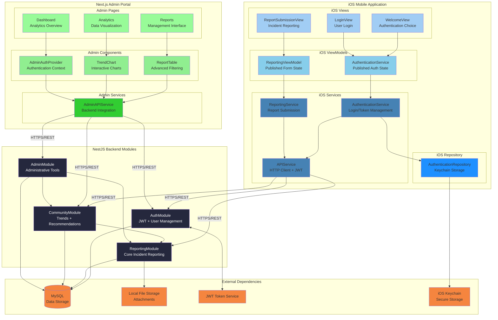
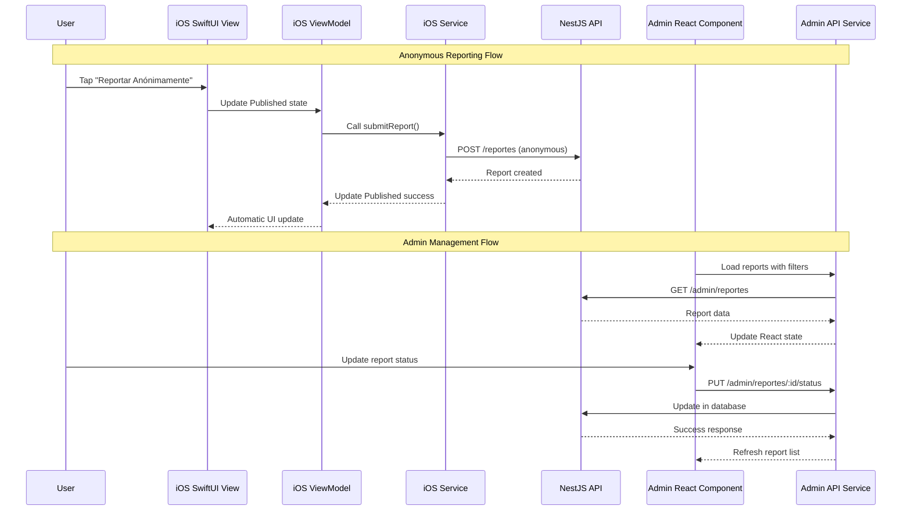

# Components

## AuthModule
**Responsibility:** Handle all authentication flows including anonymous access, user registration/login, JWT token management, and admin authentication

**Key Interfaces:**
- POST `/auth/register` - User registration endpoint
- POST `/auth/login` - User authentication endpoint  
- POST `/auth/refresh` - JWT token refresh
- POST `/admin/login` - Admin authentication endpoint
- GET `/auth/verify` - Token validation middleware

**Dependencies:** UserService, AdminUserService, JWT utilities, bcrypt hashing, crypto utilities for salt generation

**Technology Stack:** NestJS Guards, JWT Strategy, Passport.js integration, bcrypt password hashing with individual salt generation

## ReportingModule (Spanish: `reportes/`)
**Responsibility:** Core incident reporting functionality supporting both anonymous and identified report submissions, photo uploads, victim support, and report management

**Key Interfaces:**
- POST `/reportes` - Submit new incident report (anonymous or identified using AnonymousAuthGuard)
- POST `/reportes/upload-photo` - Upload evidence photo (JPEG, PNG, HEIC, HEIF)
- GET `/reportes` - Retrieve all reports with pagination (admin only)
- GET `/reportes/:id` - Get specific report details (privacy-filtered for regular users)
- GET `/reportes/user/mis-reportes` - Get authenticated user's own reports
- GET `/reportes/catalogs` - Get all catalog data (attack types, impacts, statuses)

**Dependencies:** ReportService, ReportsRepository, AdjuntosRepository, VictimSupportService, CatalogMappingService, AuthModule

**Technology Stack:**
- Multer file upload with disk storage (`/public/uploads/`)
- class-validator input validation
- Direct MySQL queries via mysql2/promise
- AnonymousAuthGuard for dual-mode authentication
- Victim support generation based on impact level

**Special Features:**
- **Dual-Mode Reporting**: `is_anonymous` flag controls privacy; if true and user is authenticated, `user_id` is set to NULL
- **Photo Upload**: Separate endpoint for uploading photos before report submission
- **Victim Support**: Automatic generation of context-aware recommendations when `impact != ninguno`
- **Privacy Filtering**: GET endpoints filter sensitive data for non-admin users

## CommunityModule (Spanish: `comunidad/`)
**Responsibility:** Community intelligence features including threat trends analysis, comprehensive analytics, and community alert system

**Key Interfaces:**
- GET `/comunidad/tendencias` - Attack type distribution trends (7/30/90 day periods)
- GET `/comunidad/analytics` - Comprehensive analytics with attack types, impacts, and time-based distributions
- GET `/comunidad/alerta` - Community threat alert level (verde/amarillo/rojo) based on recent activity

**Dependencies:** ComunidadService, ComunidadRepository, ReportingModule, CatalogMappingService

**Technology Stack:**
- Data aggregation queries with MySQL
- Direct SQL queries for performance
- Spanish localization for all responses
- Time-period based analysis

**Special Features:**
- **Alert Levels**: Dynamic threat level calculation based on reports in last 24 hours
  - Verde (green): < 5 reports
  - Amarillo (yellow): 5-15 reports
  - Rojo (red): > 15 reports
- **Anonymous Usage Tracking**: Insights into anonymous vs identified reporting patterns
- **Percentage Calculations**: Automatic distribution percentages for all metrics

## AdminModule
**Responsibility:** Administrative portal functionality including admin authentication, report management, user management, dashboard statistics, and investigation tracking

**Key Interfaces:**
- POST `/admin/login` - Admin authentication (separate from user auth)
- POST `/admin/register` - Register new admin user
- GET `/admin/validate-token` - Validate admin JWT token
- GET `/admin/dashboard` - Basic dashboard statistics
- GET `/admin/dashboard/enhanced` - Enhanced dashboard with trends and distributions
- GET `/admin/users/list` - List all users
- GET `/admin/users/:id` - Get specific user details
- GET `/admin/reports` - Filtered reports list with full details
- GET `/admin/reports/search` - Advanced report search with highlighting
- GET `/admin/reports/:id` - Get specific report (admin view)
- PUT `/admin/reports/:id/status` - Update report status with optional notes
- GET `/admin/reports/:id/notes` - Get report notes (stub implementation)
- POST `/admin/reports/:id/notes` - Add report note (stub implementation)
- PUT `/admin/notes/:id` - Update note (stub implementation)
- POST `/admin/notes/:id` - Delete note (stub implementation)

**Dependencies:** AdminService, AdminRepository, UsersService, ReportesService, CatalogMappingService, AuthModule (AdminAuthGuard)

**Technology Stack:**
- Advanced MySQL queries with JOINs
- AdminAuthGuard for JWT-based admin authentication
- Service reuse pattern (imports UsersService and ReportesService)
- Separate `admins` table from regular users

**Special Features:**
- **Service Reuse**: AdminModule imports and reuses existing UsersService and ReportesService following DRY principle
- **Enhanced Statistics**: Weekly/monthly trends, status distribution, attack type breakdown, impact distribution, response time metrics
- **Admin Notes**: Basic implementation via `admin_notes` field in reports table; separate notes endpoints are stubs
- **User Management**: Full CRUD operations on user accounts
- **Report Management**: Complete filtering, search, view, and status update capabilities

## CatalogModule
**Responsibility:** Centralized catalog management and bidirectional ID ↔ string mapping for attack types, impacts, and statuses

**Key Components:**
- CatalogRepository - Database queries for catalog tables
- CatalogMappingService - Bidirectional conversion between IDs and string values

**Technology Stack:**
- Direct MySQL queries to catalog tables
- TypeScript enums for type safety
- Shared across all modules

**Special Features:**
- **Bidirectional Mapping**: Converts between database IDs (integers) and API strings
  - Database stores: `attack_type: 1`
  - API accepts/returns: `attack_type: "email"`
- **Centralized Management**: Single source of truth for all catalog data
- **Legacy Compatibility**: Maintains string-based API while using normalized database
- **Automatic Conversion**: Repositories handle transformation transparently

**Catalog Mappings:**
- **Attack Types**: 1=email, 2=SMS, 3=whatsapp, 4=llamada, 5=redes_sociales, 6=otro
- **Impacts**: 1=ninguno, 2=robo_datos, 3=robo_dinero, 4=cuenta_comprometida
- **Status**: 1=nuevo, 2=revisado, 3=en_investigacion, 4=cerrado

## iOS Mobile Application Components

### iOS Authentication Components
**Responsibility:** SwiftUI user authentication flow with MVVM pattern, Keychain secure storage, and session management

**Key Components:**
- `WelcomeView.swift` - Initial authentication choice screen
- `LoginView.swift` - User login form with validation
- `RegisterView.swift` - User registration with password confirmation
- `AuthenticationService.swift` - ObservableObject managing authentication state
- `AuthenticationRepository.swift` - Secure Keychain token storage

**Dependencies:** Keychain wrapper, APIService, JWT token validation, Combine framework

**Technology Stack:** SwiftUI declarative UI, @Published reactive properties, iOS Keychain Services, Combine publishers

### iOS Reporting Components
**Responsibility:** Core incident reporting functionality with anonymous/identified modes, file upload, and form validation

**Key Components:**
- `ReportSubmissionView.swift` - Main reporting interface with SwiftUI forms
- `ReportingViewModel.swift` - MVVM state management with @Published properties
- `ReportingService.swift` - API integration for report submission
- `Report.swift` - Data models with Spanish enum values
- `AnonymousReportView.swift` - Anonymous reporting entry point

**Dependencies:** ReportingService, APIService, file picker, form validation

**Technology Stack:** SwiftUI forms, @StateObject lifecycle, Combine async operations, multipart form data upload

### iOS Data and Persistence Components
**Responsibility:** Secure data models, API integration, and local data persistence for iOS application

**Key Components:**
- `APIService.swift` - Base HTTP client with JWT token management
- `AuthenticationRepository.swift` - Secure storage using iOS Keychain
- `User.swift` - User data model with Codable conformance
- `AttackType.swift` - Spanish attack type enumerations
- `ImpactLevel.swift` - Spanish impact level definitions

**Dependencies:** Foundation networking, Keychain Services, Codable protocols

**Technology Stack:** URLSession networking, iOS Keychain, Swift Codable, structured concurrency

## Next.js Admin Portal Components

### Admin Authentication Components
**Responsibility:** Admin user authentication with JWT tokens, role-based access control, and session management

**Key Components:**
- `AuthContext.tsx` - React context for admin authentication state
- `AdminAuthProvider.tsx` - Authentication state provider component
- `LoginPage.tsx` - Admin login form with validation
- `middleware.ts` - Route protection and authentication middleware
- `AdminAPIService.ts` - Admin-specific API client

**Dependencies:** Next.js App Router, React Context, localStorage, JWT validation

**Technology Stack:** Next.js 13+ App Router, React 18, TypeScript, JWT authentication

### Admin Dashboard Components
**Responsibility:** Administrative dashboard with analytics, data visualization, and report management interfaces

**Key Components:**
- `DashboardPage.tsx` - Main admin dashboard with metrics
- `AnalyticsGrid.tsx` - Key performance indicators display
- `TrendChart.tsx` - Interactive charts with Recharts integration
- `ReportTable.tsx` - Advanced report filtering and sorting
- `ExportTools.tsx` - Data export functionality

**Dependencies:** Recharts, React tables, data visualization libraries

**Technology Stack:** Next.js server components, Recharts, Tailwind CSS, React hooks

### Admin Data Management Components
**Responsibility:** Report management, status updates, user administration, and data export functionality

**Key Components:**
- `ReportFilter.tsx` - Advanced filtering interface with client-side state
- `StatusUpdate.tsx` - Report status management forms
- `UserManagement.tsx` - User account administration
- `DataExport.tsx` - CSV/Excel export functionality
- `ReportDetails.tsx` - Individual report investigation interface

**Dependencies:** AdminAPIService, form validation, file download utilities

**Technology Stack:** React client components, form libraries, data processing utilities

## Component Diagrams

### Full System Component Architecture

### Frontend Component Communication Patterns

