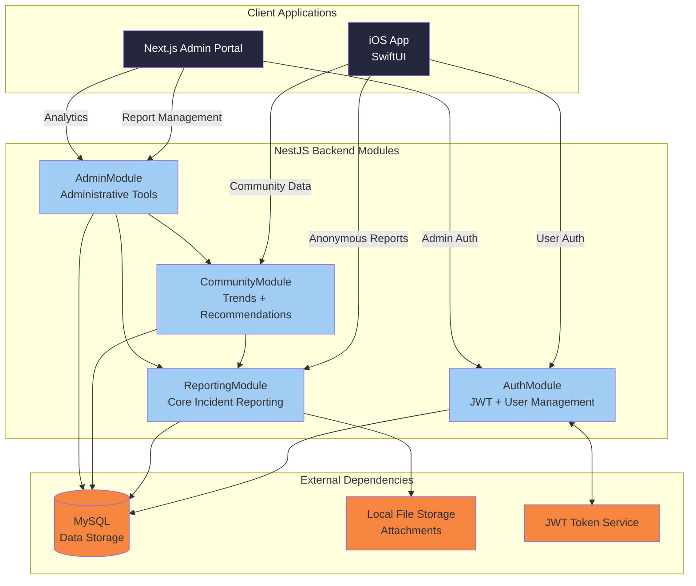

# Components

## AuthModule
**Responsibility:** Handle all authentication flows including anonymous access, user registration/login, JWT token management, and admin authentication

**Key Interfaces:**
- POST `/auth/register` - User registration endpoint
- POST `/auth/login` - User authentication endpoint  
- POST `/auth/refresh` - JWT token refresh
- POST `/admin/login` - Admin authentication endpoint
- GET `/auth/verify` - Token validation middleware

**Dependencies:** UserService, AdminUserService, JWT utilities, bcrypt hashing, crypto utilities for salt generation

**Technology Stack:** NestJS Guards, JWT Strategy, Passport.js integration, bcrypt password hashing with individual salt generation

## ReportingModule  
**Responsibility:** Core incident reporting functionality supporting both anonymous and identified report submissions, file uploads, and report management

**Key Interfaces:**
- POST `/reports` - Submit new incident report (anonymous or identified)
- GET `/reports` - Retrieve reports (admin only, with filtering/pagination)
- GET `/reports/:id` - Get specific report details
- PUT `/reports/:id/status` - Update report status (admin only)
- POST `/reports/:id/attachments` - Upload file attachments

**Dependencies:** ReportService, FileUploadService, ValidationService, AuthModule

**Technology Stack:** Multer file upload, class-validator input validation, Sequelize ORM integration

## CommunityModule
**Responsibility:** Community intelligence features including threat trends analysis, personalized security recommendations, and automated victim support

**Key Interfaces:**
- GET `/community/trends` - Popular attack patterns and trends
- GET `/community/recommendations/:reportId` - Personalized security advice
- GET `/community/support/:reportId` - Victim support resources
- GET `/community/analytics` - Community-level threat analytics

**Dependencies:** ReportingModule, AnalyticsService, RecommendationEngine

**Technology Stack:** Data aggregation queries, caching for performance, recommendation algorithms

## AdminModule
**Responsibility:** Administrative portal functionality including report management, advanced filtering, status updates, and investigation tracking

**Key Interfaces:**
- GET `/admin/dashboard` - Admin dashboard with key metrics
- GET `/admin/reports` - Advanced report search and filtering
- PUT `/admin/reports/:id/notes` - Add investigation notes
- GET `/admin/analytics` - Comprehensive platform analytics
- GET `/admin/exports` - Data export functionality

**Dependencies:** ReportingModule, CommunityModule, AuthModule (admin guards)

**Technology Stack:** Advanced MySQL queries, data export utilities, admin-specific Guards

## Component Diagrams

