# Components

## AuthModule
**Responsibility:** Handle all authentication flows including anonymous access, user registration/login, JWT token management, and admin authentication

**Key Interfaces:**
- POST `/auth/register` - User registration endpoint
- POST `/auth/login` - User authentication endpoint  
- POST `/auth/refresh` - JWT token refresh
- POST `/admin/login` - Admin authentication endpoint
- GET `/auth/verify` - Token validation middleware

**Dependencies:** UserService, AdminUserService, JWT utilities, bcrypt hashing, crypto utilities for salt generation

**Technology Stack:** NestJS Guards, JWT Strategy, Passport.js integration, bcrypt password hashing with individual salt generation

## ReportingModule  
**Responsibility:** Core incident reporting functionality supporting both anonymous and identified report submissions, file uploads, and report management

**Key Interfaces:**
- POST `/reports` - Submit new incident report (anonymous or identified)
- GET `/reports` - Retrieve reports (admin only, with filtering/pagination)
- GET `/reports/:id` - Get specific report details
- PUT `/reports/:id/status` - Update report status (admin only)
- POST `/reports/:id/attachments` - Upload file attachments

**Dependencies:** ReportService, FileUploadService, ValidationService, AuthModule

**Technology Stack:** Multer file upload, class-validator input validation, Sequelize ORM integration

## CommunityModule
**Responsibility:** Community intelligence features including threat trends analysis, personalized security recommendations, and automated victim support

**Key Interfaces:**
- GET `/community/trends` - Popular attack patterns and trends
- GET `/community/recommendations/:reportId` - Personalized security advice
- GET `/community/support/:reportId` - Victim support resources
- GET `/community/analytics` - Community-level threat analytics

**Dependencies:** ReportingModule, AnalyticsService, RecommendationEngine

**Technology Stack:** Data aggregation queries, caching for performance, recommendation algorithms

## AdminModule
**Responsibility:** Administrative portal functionality including report management, advanced filtering, status updates, and investigation tracking

**Key Interfaces:**
- GET `/admin/dashboard` - Admin dashboard with key metrics
- GET `/admin/reports` - Advanced report search and filtering
- PUT `/admin/reports/:id/notes` - Add investigation notes
- GET `/admin/analytics` - Comprehensive platform analytics
- GET `/admin/exports` - Data export functionality

**Dependencies:** ReportingModule, CommunityModule, AuthModule (admin guards)

**Technology Stack:** Advanced MySQL queries, data export utilities, admin-specific Guards

## iOS Mobile Application Components

### iOS Authentication Components
**Responsibility:** SwiftUI user authentication flow with MVVM pattern, Keychain secure storage, and session management

**Key Components:**
- `WelcomeView.swift` - Initial authentication choice screen
- `LoginView.swift` - User login form with validation
- `RegisterView.swift` - User registration with password confirmation
- `AuthenticationService.swift` - ObservableObject managing authentication state
- `AuthenticationRepository.swift` - Secure Keychain token storage

**Dependencies:** Keychain wrapper, APIService, JWT token validation, Combine framework

**Technology Stack:** SwiftUI declarative UI, @Published reactive properties, iOS Keychain Services, Combine publishers

### iOS Reporting Components
**Responsibility:** Core incident reporting functionality with anonymous/identified modes, file upload, and form validation

**Key Components:**
- `ReportSubmissionView.swift` - Main reporting interface with SwiftUI forms
- `ReportingViewModel.swift` - MVVM state management with @Published properties
- `ReportingService.swift` - API integration for report submission
- `Report.swift` - Data models with Spanish enum values
- `AnonymousReportView.swift` - Anonymous reporting entry point

**Dependencies:** ReportingService, APIService, file picker, form validation

**Technology Stack:** SwiftUI forms, @StateObject lifecycle, Combine async operations, multipart form data upload

### iOS Data and Persistence Components
**Responsibility:** Secure data models, API integration, and local data persistence for iOS application

**Key Components:**
- `APIService.swift` - Base HTTP client with JWT token management
- `AuthenticationRepository.swift` - Secure storage using iOS Keychain
- `User.swift` - User data model with Codable conformance
- `AttackType.swift` - Spanish attack type enumerations
- `ImpactLevel.swift` - Spanish impact level definitions

**Dependencies:** Foundation networking, Keychain Services, Codable protocols

**Technology Stack:** URLSession networking, iOS Keychain, Swift Codable, structured concurrency

## Next.js Admin Portal Components

### Admin Authentication Components
**Responsibility:** Admin user authentication with JWT tokens, role-based access control, and session management

**Key Components:**
- `AuthContext.tsx` - React context for admin authentication state
- `AdminAuthProvider.tsx` - Authentication state provider component
- `LoginPage.tsx` - Admin login form with validation
- `middleware.ts` - Route protection and authentication middleware
- `AdminAPIService.ts` - Admin-specific API client

**Dependencies:** Next.js App Router, React Context, localStorage, JWT validation

**Technology Stack:** Next.js 13+ App Router, React 18, TypeScript, JWT authentication

### Admin Dashboard Components
**Responsibility:** Administrative dashboard with analytics, data visualization, and report management interfaces

**Key Components:**
- `DashboardPage.tsx` - Main admin dashboard with metrics
- `AnalyticsGrid.tsx` - Key performance indicators display
- `TrendChart.tsx` - Interactive charts with Recharts integration
- `ReportTable.tsx` - Advanced report filtering and sorting
- `ExportTools.tsx` - Data export functionality

**Dependencies:** Recharts, React tables, data visualization libraries

**Technology Stack:** Next.js server components, Recharts, Tailwind CSS, React hooks

### Admin Data Management Components
**Responsibility:** Report management, status updates, user administration, and data export functionality

**Key Components:**
- `ReportFilter.tsx` - Advanced filtering interface with client-side state
- `StatusUpdate.tsx` - Report status management forms
- `UserManagement.tsx` - User account administration
- `DataExport.tsx` - CSV/Excel export functionality
- `ReportDetails.tsx` - Individual report investigation interface

**Dependencies:** AdminAPIService, form validation, file download utilities

**Technology Stack:** React client components, form libraries, data processing utilities

## Component Diagrams

### Full System Component Architecture

### Frontend Component Communication Patterns

```mermaid
sequenceDiagram
    participant User
    participant iOSView as iOS SwiftUI View
    participant ViewModel as iOS ViewModel
    participant Service as iOS Service
    participant API as NestJS API
    participant AdminView as Admin React Component
    participant AdminAPI as Admin API Service

    Note over User,AdminAPI: Anonymous Reporting Flow
    User->>iOSView: Tap "Reportar Anónimamente"
    iOSView->>ViewModel: Update Published state
    ViewModel->>Service: Call submitReport()
    Service->>API: POST /reportes (anonymous)
    API-->>Service: Report created
    Service-->>ViewModel: Update Published success
    ViewModel-->>iOSView: Automatic UI update

    Note over User,AdminAPI: Admin Management Flow
    AdminView->>AdminAPI: Load reports with filters
    AdminAPI->>API: GET /admin/reportes
    API-->>AdminAPI: Report data
    AdminAPI-->>AdminView: Update React state
    User->>AdminView: Update report status
    AdminView->>AdminAPI: PUT /admin/reportes/:id/status
    AdminAPI->>API: Update in database
    API-->>AdminAPI: Success response
    AdminAPI-->>AdminView: Refresh report list
```

