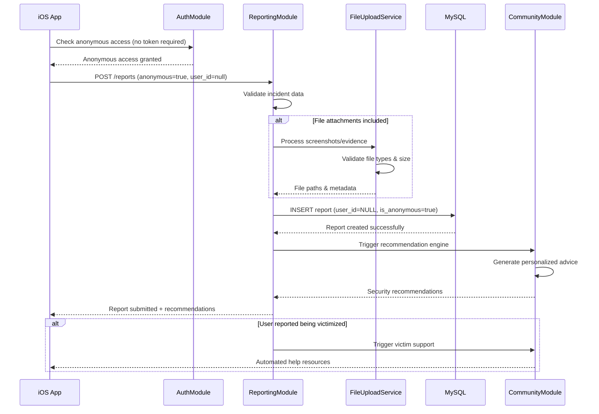
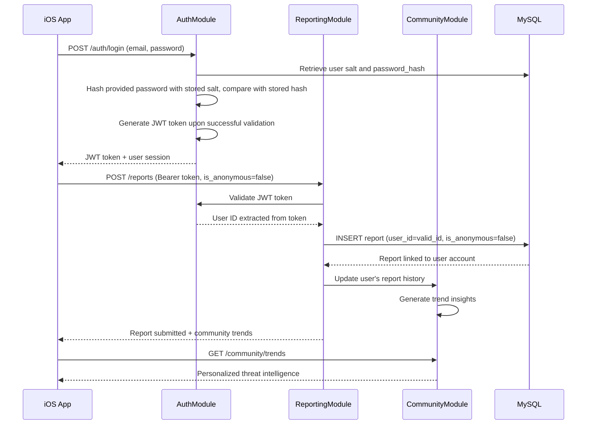
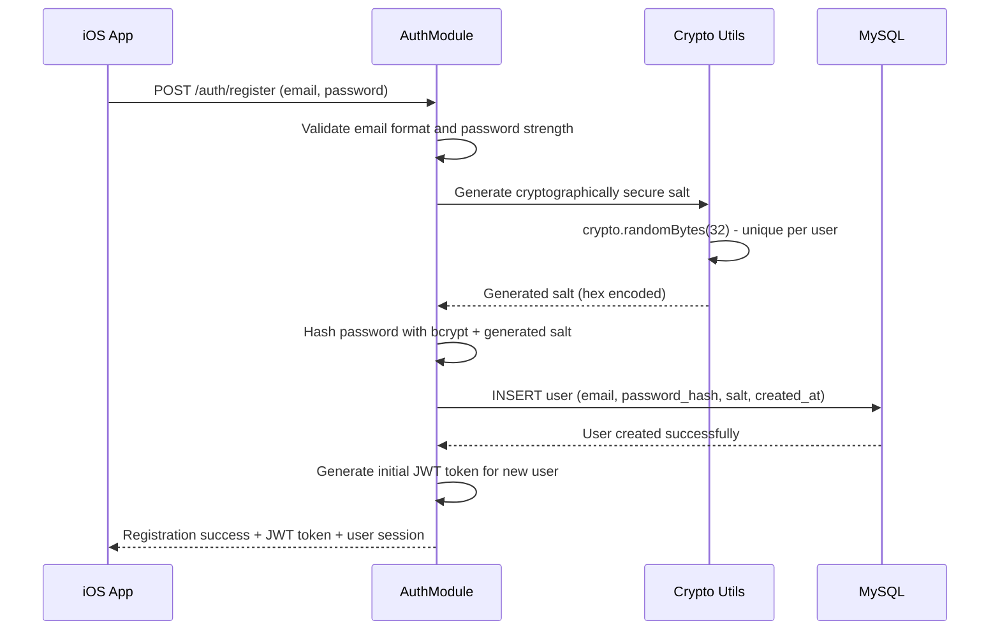
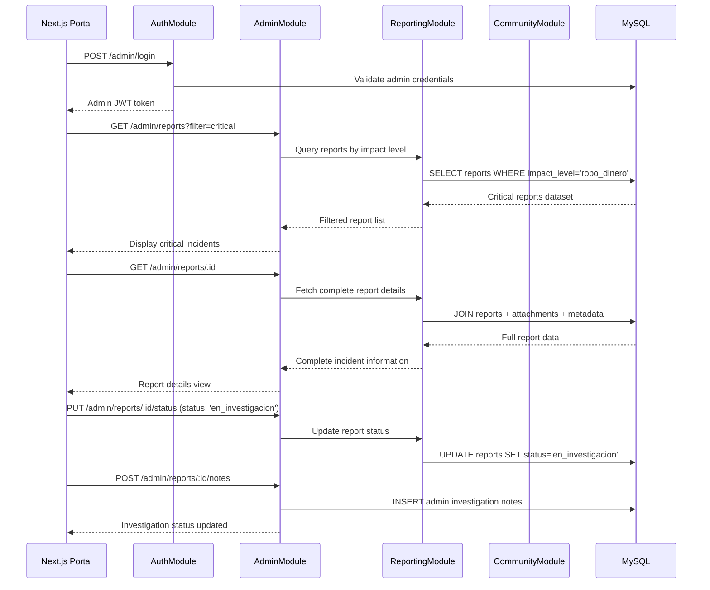

# Core Workflows

## Anonymous Incident Reporting Workflow

```mermaid
sequenceDiagram
    participant iOS as iOS App
    participant Auth as AuthModule
    participant Report as ReportingModule
    participant File as FileUploadService
    participant DB as MySQL
    participant Community as CommunityModule
    
    iOS->>Auth: Check anonymous access (no token required)
    Auth-->>iOS: Anonymous access granted
    
    iOS->>Report: POST /reports (anonymous=true, user_id=null)
    Report->>Report: Validate incident data
    
    alt File attachments included
        Report->>File: Process screenshots/evidence
        File->>File: Validate file types & size
        File-->>Report: File paths & metadata
    end
    
    Report->>DB: INSERT report (user_id=NULL, is_anonymous=true)
    DB-->>Report: Report created successfully
    
    Report->>Community: Trigger recommendation engine
    Community->>Community: Generate personalized advice
    Community-->>Report: Security recommendations
    
    Report-->>iOS: Report submitted + recommendations
    
    alt User reported being victimized
        Report->>Community: Trigger victim support
        Community-->>iOS: Automated help resources
    end
```

## Registered User Identified Reporting Workflow

```mermaid
sequenceDiagram
    participant iOS as iOS App
    participant Auth as AuthModule
    participant Report as ReportingModule
    participant Community as CommunityModule
    participant DB as MySQL
    
    iOS->>Auth: POST /auth/login (email, password)
    Auth->>DB: Retrieve user salt and password_hash
    Auth->>Auth: Hash provided password with stored salt, compare with stored hash
    Auth->>Auth: Generate JWT token upon successful validation
    Auth-->>iOS: JWT token + user session
    
    iOS->>Report: POST /reports (Bearer token, is_anonymous=false)
    Report->>Auth: Validate JWT token
    Auth-->>Report: User ID extracted from token
    
    Report->>DB: INSERT report (user_id=valid_id, is_anonymous=false)
    DB-->>Report: Report linked to user account
    
    Report->>Community: Update user's report history
    Community->>Community: Generate trend insights
    
    Report-->>iOS: Report submitted + community trends
    iOS->>Community: GET /community/trends
    Community-->>iOS: Personalized threat intelligence
```

## User Registration Workflow

```mermaid
sequenceDiagram
    participant iOS as iOS App
    participant Auth as AuthModule
    participant Crypto as Crypto Utils
    participant DB as MySQL
    
    iOS->>Auth: POST /auth/register (email, password)
    Auth->>Auth: Validate email format and password strength
    Auth->>Crypto: Generate cryptographically secure salt
    Crypto->>Crypto: crypto.randomBytes(32) - unique per user
    Crypto-->>Auth: Generated salt (hex encoded)
    
    Auth->>Auth: Hash password with bcrypt + generated salt
    Auth->>DB: INSERT user (email, password_hash, salt, created_at)
    DB-->>Auth: User created successfully
    
    Auth->>Auth: Generate initial JWT token for new user
    Auth-->>iOS: Registration success + JWT token + user session
```

## Admin Report Investigation Workflow

```mermaid
sequenceDiagram
    participant Admin as Next.js Portal
    participant Auth as AuthModule
    participant AdminMod as AdminModule
    participant Report as ReportingModule
    participant Community as CommunityModule
    participant DB as MySQL
    
    Admin->>Auth: POST /admin/login
    Auth->>DB: Validate admin credentials
    Auth-->>Admin: Admin JWT token
    
    Admin->>AdminMod: GET /admin/reports?filter=critical
    AdminMod->>Report: Query reports by impact level
    Report->>DB: SELECT reports WHERE impact_level='robo_dinero'
    DB-->>Report: Critical reports dataset
    Report-->>AdminMod: Filtered report list
    AdminMod-->>Admin: Display critical incidents
    
    Admin->>AdminMod: GET /admin/reports/:id
    AdminMod->>Report: Fetch complete report details
    Report->>DB: JOIN reports + attachments + metadata
    DB-->>Report: Full report data
    Report-->>AdminMod: Complete incident information
    AdminMod-->>Admin: Report details view
    
    Admin->>AdminMod: PUT /admin/reports/:id/status (status: 'en_investigacion')
    AdminMod->>Report: Update report status
    Report->>DB: UPDATE reports SET status='en_investigacion'
    
    Admin->>AdminMod: POST /admin/reports/:id/notes
    AdminMod->>DB: INSERT admin investigation notes
    
    AdminMod-->>Admin: Investigation status updated
```
