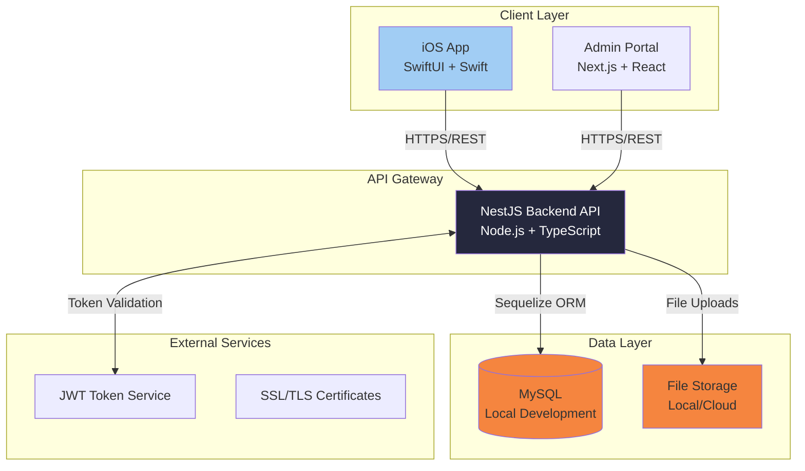

# High Level Architecture

## Technical Summary

SafeTrade employs a **modern three-tier architecture** with native mobile client, enterprise-grade backend API, and web-based administrative interface. The system uses **NestJS microservice-ready monolith** for rapid development with future scaling capabilities, **MySQL relational database** for structured data integrity, and **JWT-based authentication with salt-enhanced password security** supporting both anonymous and identified user flows. Core architectural patterns include **Repository Pattern** for data access, **Service Layer Architecture** for business logic separation, and **Event-Driven Communication** for future extensibility. This architecture directly supports PRD goals by enabling friction-free mobile reporting, community intelligence aggregation, and administrative oversight while maintaining 99.5% uptime and sub-2-second response times.

## High Level Overview

**Architectural Style:** Modular Monolith with Microservice-Ready Design
- Single deployable NestJS backend with clear module boundaries (auth, reporting, analytics, community)
- Internal service separation enables future microservice migration as community scales

**Repository Structure:** Monorepo (from PRD)
- Unified codebase management for iOS app, NestJS backend, and Next.js admin portal
- Shared TypeScript types and utilities across backend and admin frontend

**Service Architecture:** NestJS Monolithic Backend (from PRD decision)
- Faster development and simplified deployment for academic timeline
- Internal module architecture: AuthModule, ReportingModule, AnalyticsModule, CommunityModule

**Primary User Interaction Flow:**
1. **Mobile Entry:** iOS app → Authentication choice (anonymous/registered) → Report submission → Community trends
2. **Data Flow:** Mobile reports → NestJS API → MySQL → Analytics processing → Community insights
3. **Admin Flow:** Web portal → Report management → Status updates → Analytics dashboard

**Key Architectural Decisions:**
- **NestJS over Express:** Enterprise patterns, TypeScript-first, dependency injection for scalable module architecture
- **Next.js for Admin:** SSR capabilities, built-in optimizations, potential API route supplementation
- **JWT Authentication:** Stateless tokens supporting both anonymous and identified reporting workflows

## High Level Project Diagram

## Architectural and Design Patterns

**Core Patterns Selected:**

- **Modular Monolith Architecture:** NestJS modules (Auth, Reporting, Analytics, Community) with clear boundaries - _Rationale:_ Balances development speed with future scalability, perfect for academic timeline while maintaining enterprise structure

- **Repository Pattern:** Abstract data access through repositories and services - _Rationale:_ Enables testing, database migration flexibility, and clean separation between business logic and data persistence

- **JWT Stateless Authentication:** Token-based authentication with refresh rotation and salt-enhanced password security - _Rationale:_ Supports both anonymous and identified user flows, scalable across multiple clients (iOS + web), enhanced security with individual user salts

- **Event-Driven Notifications:** Internal event system for user actions and report processing - _Rationale:_ Decouples components, enables future real-time features, supports analytics tracking

- **Service Layer Pattern:** Business logic encapsulated in NestJS services - _Rationale:_ Clear separation of concerns, testable business rules, dependency injection support

- **API Gateway Pattern:** Single NestJS backend serving multiple clients - _Rationale:_ Unified API surface, consistent authentication, simplified deployment for academic project
