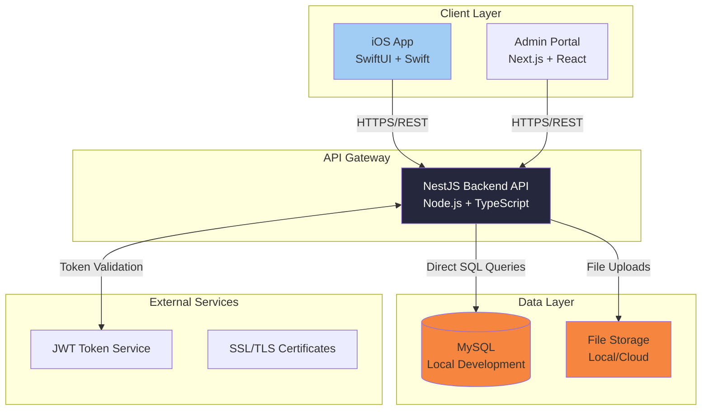

# High Level Architecture

## Technical Summary

SafeTrade employs a **modern modular monolith architecture** with native mobile client, enterprise-grade backend API, and web-based administrative interface. The system uses **NestJS with repository pattern** for rapid development with clear module boundaries, **MySQL relational database** with direct query approach for performance and simplicity, and **triple JWT-based authentication** supporting anonymous, registered user, and admin flows. Core architectural patterns include **Repository Pattern** for data access, **Service Layer Architecture** for business logic separation, and **Module Reuse Strategy** for admin functionality. This architecture directly supports PRD goals by enabling friction-free mobile reporting, community intelligence aggregation, and administrative oversight while maintaining 99.5% uptime and sub-2-second response times.

## High Level Overview

**Architectural Style:** Modular Monolith with Microservice-Ready Design
- Single deployable NestJS backend with clear module boundaries (auth, reporting, analytics, community)
- Internal service separation enables future microservice migration as community scales

**Repository Structure:** Monorepo (from PRD)
- Unified codebase management for iOS app, NestJS backend, and Next.js admin portal
- Shared TypeScript types and utilities across backend and admin frontend

**Service Architecture:** NestJS Modular Backend with Repository Pattern
- Controller → Service → Repository pattern for clean separation
- Internal module architecture: AuthModule, UsersModule, ReportesModule, ComunidadModule, AdminModule
- Admin module reuses existing UsersService and ReportesService for DRY principle

**Primary User Interaction Flow:**
1. **Mobile Entry:** iOS app → Authentication choice (anonymous/registered) → Report submission → Community trends
2. **Data Flow:** Mobile reports → NestJS API → MySQL → Analytics processing → Community insights
3. **Admin Flow:** Web portal → Report management → Status updates → Analytics dashboard

**Key Architectural Decisions:**
- **NestJS over Express:** Enterprise patterns, TypeScript-first, dependency injection for scalable module architecture
- **Next.js for Admin:** SSR capabilities, built-in optimizations, potential API route supplementation
- **MySQL with Direct Queries:** Direct SQL approach for performance and simplicity over ORM abstraction
- **Triple JWT Authentication:** Anonymous access, user tokens, and admin tokens with different permissions

## High Level Project Diagram

## Architectural and Design Patterns

**Core Patterns Selected:**

- **Modular Monolith Architecture:** NestJS modules (Auth, Users, Reportes, Comunidad, Admin) with clear boundaries and service reuse - _Rationale:_ Balances development speed with maintainability, AdminModule reuses existing services following DRY principle

- **Repository Pattern:** Controller → Service → Repository pattern with direct MySQL queries - _Rationale:_ Clean separation of concerns, performance optimization through direct SQL, easy testing and maintenance

- **Triple JWT Authentication:** Anonymous access, user tokens, and admin tokens with different permission levels - _Rationale:_ Supports friction-free reporting (anonymous), user accounts, and administrative access with proper security boundaries

- **Event-Driven Notifications:** Internal event system for user actions and report processing - _Rationale:_ Decouples components, enables future real-time features, supports analytics tracking

- **Service Layer Pattern:** Business logic encapsulated in NestJS services - _Rationale:_ Clear separation of concerns, testable business rules, dependency injection support

- **API Gateway Pattern:** Single NestJS backend serving multiple clients - _Rationale:_ Unified API surface, consistent authentication, simplified deployment for academic project

## Implemented Spanish Endpoints

**Current Implementation Status:**
The SafeTrade backend has been successfully restructured with the following Spanish endpoints:

### Authentication & User Management
- `POST /auth/login` - User authentication
- `POST /auth/refresh` - Token renewal
- `GET /auth/profile` - User profile (requires JWT)
- `POST /users/register` - User registration
- `GET /users/profile` - User profile (authenticated)

### Incident Reporting (Spanish Module Names)
- `POST /reportes` - Create cybersecurity incident report (anonymous + authenticated)
- `GET /reportes/:id` - Get specific report details
- `GET /reportes/user/mis-reportes` - User's own reports (authenticated)

### Community Intelligence (Spanish Module Names)
- `GET /comunidad/tendencias` - Community threat trends with Spanish translations
- `GET /comunidad/recomendaciones/:reporteId` - Personalized security recommendations
- `GET /comunidad/analytics` - Community analytics and insights
- `GET /comunidad/alerta` - Community alert status

### Admin Management (Reuses Services)
- `POST /admin/login` - Admin authentication
- `GET /admin/users/list` - All users list (admin only)
- `GET /admin/users/:id` - Specific user details (admin only)
- `GET /admin/dashboard` - Admin dashboard statistics
- `GET /admin/reportes` - Filtered reports list (admin only)

### Key Implementation Features
- **Module Reuse**: AdminModule imports and reuses UsersService and ReportesService
- **Triple Authentication**: Anonymous, JWT user tokens, JWT admin tokens
- **Spanish Localization**: All responses, error messages, and DTOs in Spanish
- **File Upload Support**: Incident reports support screenshot attachments
- **Community Intelligence**: Automated threat trend analysis and personalized recommendations
- **Database Performance**: Direct MySQL queries with proper indexing for sub-2-second response times
