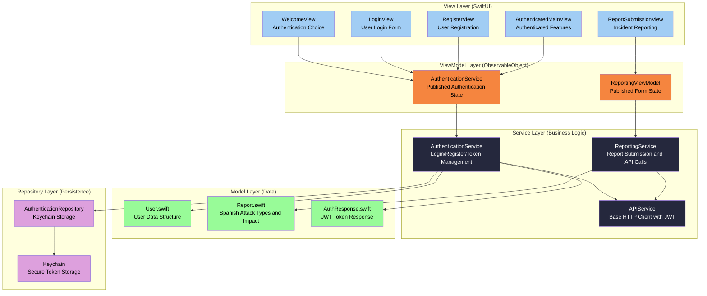

# iOS Mobile Application Architecture

## Technical Summary

The SafeTrade iOS application employs a **modern SwiftUI MVVM architecture** with reactive state management through Combine framework, secure authentication with Keychain storage, and comprehensive Spanish localization. The architecture follows Apple's declarative UI patterns with **@StateObject/@ObservedObject** for view model binding, **structured concurrency** with async/await for API calls, and **repository pattern** for data persistence. The application supports both anonymous and authenticated reporting flows with automatic session persistence, JWT token management, and seamless backend integration through RESTful APIs.

## iOS Application Overview

**Architectural Pattern:** Model-View-ViewModel (MVVM) with Combine Reactive Programming
- **Views**: SwiftUI declarative UI components with data binding
- **ViewModels**: ObservableObject classes managing UI state and business logic
- **Services**: API communication layer with authentication and error handling
- **Models**: Codable data structures matching backend Spanish schemas
- **Repository**: Secure data persistence with Keychain integration

**Primary User Flows:**
1. **Authentication Flow**: Welcome → Login/Register → Token Storage → Authenticated State
2. **Anonymous Reporting**: Direct to reporting form → Submit → Recommendations
3. **Identified Reporting**: Authentication check → Report type selection → Submit → History tracking
4. **Session Management**: Automatic token refresh → Background session persistence

**Key Architectural Decisions:**
- **SwiftUI over UIKit**: Modern declarative UI with automatic state synchronization
- **Combine Framework**: Reactive programming for API calls and state management
- **MVVM Pattern**: Clear separation of concerns with testable business logic
- **Keychain Storage**: Secure JWT token and user data persistence
- **Spanish-First Localization**: All UI text and error messages in Spanish

## SwiftUI MVVM Architecture Pattern

### Core Components



### MVVM Implementation Details

**Views (SwiftUI)**
- **Declarative UI**: Views automatically update when ViewModel @Published properties change
- **Data Binding**: Two-way binding with @StateObject and @ObservedObject
- **Navigation**: Programmatic navigation based on authentication state
- **Form Validation**: Real-time validation feedback with Spanish error messages

**ViewModels (ObservableObject)**
- **State Management**: @Published properties for UI state synchronization
- **Business Logic**: Form validation, error handling, API call coordination
- **Reactive Updates**: Combine publishers for automatic UI updates
- **Spanish Localization**: All user-facing messages in Spanish

**Example ViewModel Pattern:**
```swift
@MainActor
class ReportingViewModel: ObservableObject {
    @Published var isAnonymous: Bool = true
    @Published var selectedAttackType: AttackType = .email
    @Published var isSubmitting: Bool = false
    @Published var alertMessage: String = ""

    private let reportingService: ReportingService
    private var cancellables = Set<AnyCancellable>()

    func submitReport() {
        reportingService.submitReport(request)
            .receive(on: DispatchQueue.main)
            .sink(receiveCompletion: handleCompletion,
                  receiveValue: handleResponse)
            .store(in: &cancellables)
    }
}
```

## iOS State Management Strategy

### Authentication State Management

**AuthenticationService Pattern:**
- **Singleton Pattern**: Shared instance across the application
- **Observable State**: @Published properties for authentication status
- **Automatic Session Restoration**: Checks Keychain on app launch
- **Token Management**: Automatic refresh before expiration

**State Flow:**
```
App Launch → Check Keychain → Set Authentication State → Update UI
Login Success → Store Tokens → Update State → Navigate to Main
Token Refresh → Background Refresh → Continue Session
Logout → Clear Keychain → Reset State → Return to Welcome
```

### Form State Management

**ReportingViewModel State:**
- **Form Fields**: @Published properties for all form inputs
- **Validation State**: Real-time validation with Spanish error messages
- **Submission State**: Loading indicators and success/error handling
- **File Upload State**: Attachment management and progress tracking

### Reactive State Updates

**Combine Integration:**
- **Publisher/Subscriber Pattern**: API calls return Combine publishers
- **Automatic UI Updates**: @Published properties trigger SwiftUI view updates
- **Error Handling**: Centralized error handling with Spanish localization
- **Background Threading**: API calls on background queue, UI updates on main queue

## iOS API Integration Patterns

### APIService Architecture

**Base HTTP Client:**
```swift
class APIService: ObservableObject {
    static let shared = APIService()
    private let baseURL = "http://localhost:3000"
    private var authToken: String?

    func setAuthToken(_ token: String?) {
        self.authToken = token
    }

    func request<T: Codable>(_ endpoint: String,
                           method: HTTPMethod,
                           body: Data? = nil) -> AnyPublisher<T, Error>
}
```

**Authentication Integration:**
- **Automatic Token Injection**: JWT tokens automatically added to requests
- **Token Refresh**: Automatic refresh on 401 responses
- **Spanish Error Messages**: Backend error messages displayed in Spanish
- **Request/Response Logging**: Debug logging for development

### Service Layer Pattern

**Specialized Services:**
- **AuthenticationService**: Login, register, token management
- **ReportingService**: Report submission, file upload, history retrieval
- **APIService**: Base HTTP client with authentication

**API Endpoint Mapping:**
```swift
// Authentication Endpoints
POST /auth/login          → AuthenticationService.login()
POST /users/register      → AuthenticationService.register()
POST /auth/refresh        → AuthenticationService.refreshToken()

// Reporting Endpoints (Spanish)
POST /reportes            → ReportingService.submitReport()
GET /reportes/user/mis-reportes → ReportingService.getUserReports()

// Community Endpoints (Spanish)
GET /comunidad/tendencias → CommunityService.getTrends()
GET /comunidad/recomendaciones → CommunityService.getRecommendations()
```

## iOS Data Models

### Core Data Structures

**User Model:**
```swift
struct User: Codable, Identifiable {
    let id: Int
    let email: String
    let name: String
    let createdAt: String
    let lastLogin: String?
}
```

**Report Model with Spanish Enums:**
```swift
struct Report: Codable, Identifiable {
    let id: Int
    let attackType: AttackType
    let incidentDate: String
    let attackOrigin: String
    let impactLevel: ImpactLevel
    let isAnonymous: Bool
    let userId: Int?
}

enum AttackType: String, CaseIterable, Codable {
    case email = "email"
    case sms = "SMS"
    case whatsapp = "whatsapp"
    case llamada = "llamada"
    case redesSociales = "redes_sociales"
    case otro = "otro"

    var displayName: String {
        switch self {
        case .email: return "Correo Electrónico"
        case .sms: return "SMS"
        case .whatsapp: return "WhatsApp"
        case .llamada: return "Llamada Telefónica"
        case .redesSociales: return "Redes Sociales"
        case .otro: return "Otro"
        }
    }
}

enum ImpactLevel: String, CaseIterable, Codable {
    case ninguno = "ninguno"
    case roboDatos = "robo_datos"
    case roboDinero = "robo_dinero"
    case cuentaComprometida = "cuenta_comprometida"

    var displayName: String {
        switch self {
        case .ninguno: return "Sin Impacto"
        case .roboDatos: return "Robo de Datos"
        case .roboDinero: return "Robo de Dinero"
        case .cuentaComprometida: return "Cuenta Comprometida"
        }
    }
}
```

### Authentication Models

**AuthResponse Structure:**
```swift
struct AuthResponse: Codable {
    let success: Bool
    let message: String
    let user: User
    let accessToken: String
    let refreshToken: String
}
```

**Request Models:**
```swift
struct LoginRequest: Codable {
    let email: String
    let password: String
}

struct RegisterRequest: Codable {
    let email: String
    let password: String
    let name: String
}

struct CreateReportRequest: Codable {
    let isAnonymous: Bool
    let attackType: String
    let incidentDate: String
    let incidentTime: String?
    let attackOrigin: String
    let suspiciousUrl: String?
    let messageContent: String?
    let impactLevel: String
    let description: String?
}
```

## Secure Data Persistence

### Keychain Integration

**AuthenticationRepository:**
```swift
class AuthenticationRepository {
    static let shared = AuthenticationRepository()
    private let keychain = Keychain(service: "com.safetrade.app")

    private let tokenKey = "access_token"
    private let refreshTokenKey = "refresh_token"
    private let userKey = "current_user"

    func storeToken(_ token: String) throws {
        try keychain.set(token, key: tokenKey)
    }

    func getToken() -> String? {
        return try? keychain.get(tokenKey)
    }

    func hasValidToken() -> Bool {
        guard let token = getToken() else { return false }
        return !isTokenExpired(token)
    }
}
```

**Security Features:**
- **Keychain Storage**: JWT tokens stored securely in iOS Keychain
- **Token Validation**: Automatic token expiration checking
- **Biometric Protection**: Optional biometric authentication for app access
- **Data Encryption**: All sensitive data encrypted at rest

### Session Management

**Automatic Session Restoration:**
1. **App Launch**: Check Keychain for valid tokens
2. **Token Validation**: Verify token expiration and format
3. **Background Refresh**: Refresh tokens before expiration
4. **Session Cleanup**: Clear expired tokens and user data

**Session Security:**
- **Token Rotation**: Automatic refresh token rotation
- **Secure Logout**: Complete Keychain cleanup on logout
- **Session Timeout**: Automatic logout after extended inactivity
- **Background Protection**: Hide sensitive content when app backgrounded

## Spanish Localization Architecture

### Localization Strategy

**Text Resources:**
- **Localizable.strings**: All UI text in Spanish
- **Error Messages**: Backend API errors displayed in Spanish
- **Form Validation**: Real-time validation messages in Spanish
- **Date/Time Formatting**: Spanish locale formatting

**Implementation Pattern:**
```swift
// UI Text
Text("Reportar Incidente")
Text("Tu reporte ayuda a proteger a toda la comunidad")

// Error Messages
"Por favor, completa todos los campos requeridos"
"Error al enviar el reporte"
"Credenciales inválidas"

// Validation Messages
"El origen del ataque es requerido"
"La URL debe comenzar con http:// o https://"
```

### Spanish Backend Integration

**API Endpoint Localization:**
- **Spanish Resource Names**: `/reportes`, `/comunidad/tendencias`
- **Spanish Enum Values**: `attack_type`, `impact_level` with Spanish values
- **Spanish Response Messages**: All API responses in Spanish
- **Spanish Error Handling**: Localized error messages from backend

## Core Components

### Authentication Components

**WelcomeView:**
- **Purpose**: Initial authentication choice screen
- **Features**: Anonymous vs. authenticated reporting options
- **Navigation**: Conditional navigation based on authentication state

**LoginView & RegisterView:**
- **Purpose**: User authentication and registration
- **Features**: Form validation, error handling, secure input
- **Integration**: Direct integration with AuthenticationService

**AuthenticatedMainView:**
- **Purpose**: Main authenticated user interface
- **Features**: Report type selection, user profile access
- **State Management**: Reactive to authentication state changes

### Reporting Components

**ReportSubmissionView:**
- **Purpose**: Core incident reporting interface
- **Features**: Attack type selection, impact assessment, file upload
- **Validation**: Real-time form validation with Spanish messages
- **Submission**: Async report submission with progress indicators

**ReportingViewModel:**
- **Purpose**: Report form state management
- **Features**: Form validation, API integration, error handling
- **Architecture**: MVVM pattern with @Published properties

### Service Layer (Business Logic Abstraction)

**AuthenticationService:**
- **Responsibilities**: Login, registration, token management, session persistence
- **Architecture**: Singleton ObservableObject with Combine publishers
- **Security**: Keychain integration and automatic token refresh

**ReportingService:**
- **Responsibilities**: Report submission, file upload, user report history
- **Architecture**: Service layer with API integration and error handling
- **Features**: Multipart form data support, Spanish response handling

**APIService:**
- **Responsibilities**: Base HTTP client with authentication
- **Architecture**: Shared instance with automatic token injection
- **Features**: Request/response logging, error handling, background queuing

## Performance and Optimization

### Memory Management

**Combine Memory Management:**
- **AnyCancellable Storage**: Proper cancellable storage in ViewModels
- **Weak References**: Prevent retain cycles in closures
- **Automatic Cleanup**: Cancellables cleaned up on ViewModel deallocation

**SwiftUI Performance:**
- **@StateObject**: Proper ViewModel lifecycle management
- **Lazy Loading**: LazyVGrid for attack type selection
- **Efficient Updates**: Minimal view recomputation with @Published granularity

### Network Optimization

**API Call Efficiency:**
- **Background Queuing**: API calls on background queue
- **Response Caching**: Appropriate caching for static data
- **Request Deduplication**: Prevent duplicate API calls
- **Connection Pooling**: URLSession shared instance

### Battery and Resource Management

**Background Behavior:**
- **Background App Refresh**: Minimal background processing
- **Location Services**: No location tracking (privacy-focused)
- **Push Notifications**: Optional for security alerts
- **Battery Efficiency**: Optimized networking and UI updates

## Security Architecture

### Authentication Security

**Token Security:**
- **Keychain Storage**: Secure token storage with iOS Keychain
- **Token Rotation**: Automatic refresh token rotation
- **Biometric Protection**: Optional biometric authentication
- **Session Management**: Secure session lifecycle management

### Data Protection

**Privacy Protection:**
- **Anonymous Reporting**: No user data stored for anonymous reports
- **Data Minimization**: Collect only necessary information
- **Local Data Encryption**: Sensitive data encrypted at rest
- **Network Security**: TLS encryption for all API communication

### Input Validation

**Client-Side Validation:**
- **Form Validation**: Real-time input validation
- **XSS Prevention**: Input sanitization for text fields
- **File Upload Security**: MIME type validation for attachments
- **URL Validation**: Suspicious URL format checking

## Future Architecture Considerations

### Scalability Enhancements

**Performance Optimizations:**
- **SwiftUI Previews**: Enhanced preview support for development
- **Modular Architecture**: Component extraction for reusability
- **Testing Infrastructure**: Comprehensive unit and UI testing
- **Analytics Integration**: User behavior tracking for UX improvements

**Feature Extensions:**
- **Push Notifications**: Real-time security alerts
- **Offline Support**: Local data storage for offline reporting
- **Multiple Language Support**: Extend beyond Spanish localization
- **Accessibility Enhancements**: VoiceOver and accessibility improvements

### Integration Possibilities

**iOS Ecosystem Integration:**
- **Shortcuts App**: Quick reporting shortcuts
- **Siri Integration**: Voice-activated reporting
- **Share Extension**: Report suspicious content from other apps
- **Background App Refresh**: Automatic threat intelligence updates

This iOS architecture provides a robust, secure, and user-friendly foundation for the SafeTrade cybersecurity reporting application while maintaining Spanish localization and following Apple's modern development patterns.