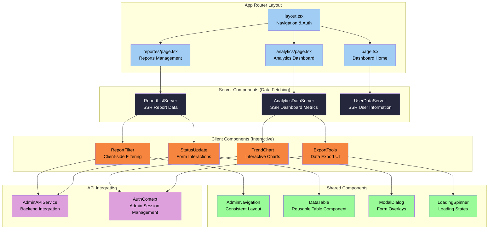

# Next.js Admin Portal Architecture

## Technical Summary

The SafeTrade admin portal employs a **modern Next.js 13+ architecture** with App Router, TypeScript, and server-side rendering capabilities. The portal provides administrative oversight for cybersecurity incident reports with **dashboard analytics**, **advanced report management**, and **comprehensive filtering systems**. The architecture follows React best practices with **component composition**, **server and client components**, **API route handlers**, and **responsive design** optimized for desktop/laptop administration workflows while maintaining Spanish localization consistency.

## Admin Portal Overview

**Architectural Pattern:** Next.js App Router with Server/Client Component Hybrid
- **App Router**: Next.js 13+ file-based routing with layout nesting
- **TypeScript**: Full type safety across components and API integration
- **Server Components**: SEO-optimized server rendering for dashboard data
- **Client Components**: Interactive UI components with state management
- **API Integration**: Direct NestJS backend integration with admin authentication

**Primary Administrative Flows:**
1. **Admin Authentication**: Login → JWT token storage → Dashboard access
2. **Report Management**: Dashboard → Report filtering → Status updates → Investigation notes
3. **Analytics Dashboard**: Real-time metrics → Community trends → Threat analysis
4. **Data Export**: Report filtering → Export configuration → Data download

**Key Architectural Decisions:**
- **Next.js 13+ App Router**: Modern routing with layout composition and loading states
- **Server/Client Split**: Server components for data fetching, client for interactivity
- **TypeScript Integration**: Shared types with backend for API consistency
- **Responsive Design**: Desktop-first with tablet/mobile adaptation
- **Spanish Localization**: Consistent with mobile app and backend

## Next.js App Router Architecture

### Directory Structure and Routing

```
packages/admin-portal/src/app/
├── layout.tsx                 # Root layout with navigation
├── page.tsx                   # Dashboard homepage
├── login/
│   └── page.tsx              # Admin authentication
├── reportes/
│   ├── page.tsx              # Reports list with filtering
│   ├── [id]/
│   │   └── page.tsx          # Individual report details
│   └── components/
│       ├── ReportFilter.tsx  # Advanced filtering component
│       ├── ReportTable.tsx   # Data table with sorting
│       └── StatusUpdate.tsx  # Report status management
├── analytics/
│   ├── page.tsx              # Analytics dashboard
│   └── components/
│       ├── TrendChart.tsx    # Community threat trends
│       ├── MetricsGrid.tsx   # Key performance indicators
│       └── ExportTools.tsx   # Data export functionality
├── usuarios/
│   ├── page.tsx              # User management
│   └── [id]/
│       └── page.tsx          # User profile details
└── api/
    ├── auth/
    │   └── route.ts          # Admin authentication API
    └── reports/
        └── route.ts          # Report management API
```

### Component Architecture Pattern



## Server and Client Component Strategy

### Server Components (Data Fetching)

**Purpose**: SEO optimization, initial data loading, and reduced JavaScript bundle size

**ReportListServer Component:**
```typescript
// Server Component - runs on server
async function ReportListServer({
  searchParams
}: {
  searchParams: { page?: string; status?: string; dateFrom?: string }
}) {
  const reports = await fetchReports({
    page: parseInt(searchParams.page || '1'),
    status: searchParams.status,
    dateFrom: searchParams.dateFrom
  });

  return (
    <div>
      <ReportTable reports={reports} />
      <ReportFilterClient />
    </div>
  );
}
```

**Benefits:**
- **SEO Optimized**: Search engines can crawl report data
- **Fast Initial Load**: Data fetched on server before page render
- **Reduced Bundle Size**: No client-side data fetching code
- **Security**: Direct database/API access without exposing credentials

### Client Components (Interactivity)

**Purpose**: User interactions, form handling, and dynamic UI updates

**ReportFilterClient Component:**
```typescript
'use client';

import { useState, useEffect } from 'react';
import { useRouter, useSearchParams } from 'next/navigation';

export function ReportFilterClient() {
  const [filters, setFilters] = useState({
    status: '',
    attackType: '',
    dateFrom: '',
    dateTo: ''
  });

  const router = useRouter();
  const searchParams = useSearchParams();

  const applyFilters = () => {
    const params = new URLSearchParams();
    Object.entries(filters).forEach(([key, value]) => {
      if (value) params.set(key, value);
    });
    router.push(`/reportes?${params.toString()}`);
  };

  return (
    <div className="filter-panel">
      {/* Filter form components */}
    </div>
  );
}
```

**Features:**
- **Interactive Forms**: Real-time filter updates and validation
- **State Management**: Local component state for UI interactions
- **Navigation**: Client-side routing for smooth transitions
- **Event Handling**: Form submissions and user interactions

## Admin Authentication Architecture

### JWT-Based Admin Authentication

**Authentication Flow:**
```
Admin Login → NestJS /admin/login → JWT Token → Context Storage → Protected Routes
```

**AuthContext Implementation:**
```typescript
'use client';

import { createContext, useContext, useEffect, useState } from 'react';

interface AdminAuthContext {
  isAuthenticated: boolean;
  adminUser: AdminUser | null;
  login: (email: string, password: string) => Promise<void>;
  logout: () => void;
  loading: boolean;
}

const AuthContext = createContext<AdminAuthContext>({} as AdminAuthContext);

export function AdminAuthProvider({ children }: { children: React.ReactNode }) {
  const [isAuthenticated, setIsAuthenticated] = useState(false);
  const [adminUser, setAdminUser] = useState<AdminUser | null>(null);
  const [loading, setLoading] = useState(true);

  useEffect(() => {
    checkAuthStatus();
  }, []);

  const checkAuthStatus = async () => {
    const token = localStorage.getItem('admin_token');
    if (token) {
      try {
        const user = await verifyAdminToken(token);
        setAdminUser(user);
        setIsAuthenticated(true);
      } catch (error) {
        localStorage.removeItem('admin_token');
      }
    }
    setLoading(false);
  };

  return (
    <AuthContext.Provider value={{ isAuthenticated, adminUser, login, logout, loading }}>
      {children}
    </AuthContext.Provider>
  );
}
```

### Protected Route Pattern

**Route Protection:**
```typescript
// middleware.ts
import { NextResponse } from 'next/server';
import type { NextRequest } from 'next/server';

export function middleware(request: NextRequest) {
  const token = request.cookies.get('admin_token');

  if (!token && request.nextUrl.pathname.startsWith('/admin')) {
    return NextResponse.redirect(new URL('/login', request.url));
  }

  return NextResponse.next();
}

export const config = {
  matcher: ['/reportes/:path*', '/analytics/:path*', '/usuarios/:path*']
};
```

## Data Management and API Integration

### Backend API Integration

**AdminAPIService:**
```typescript
class AdminAPIService {
  private baseURL = process.env.NEXT_PUBLIC_API_URL || 'http://localhost:3000';
  private authToken: string | null = null;

  setAuthToken(token: string) {
    this.authToken = token;
  }

  async getReports(filters: ReportFilters): Promise<ReportResponse> {
    const queryParams = new URLSearchParams(filters);
    const response = await fetch(`${this.baseURL}/admin/reportes?${queryParams}`, {
      headers: {
        'Authorization': `Bearer ${this.authToken}`,
        'Content-Type': 'application/json'
      }
    });

    if (!response.ok) {
      throw new Error(`API Error: ${response.statusText}`);
    }

    return response.json();
  }

  async updateReportStatus(id: number, status: string, notes?: string): Promise<void> {
    await fetch(`${this.baseURL}/admin/reportes/${id}/status`, {
      method: 'PUT',
      headers: {
        'Authorization': `Bearer ${this.authToken}`,
        'Content-Type': 'application/json'
      },
      body: JSON.stringify({ status, notes })
    });
  }

  async getAnalytics(dateRange: DateRange): Promise<AnalyticsData> {
    const params = new URLSearchParams({
      from: dateRange.from.toISOString(),
      to: dateRange.to.toISOString()
    });

    const response = await fetch(`${this.baseURL}/admin/analytics?${params}`, {
      headers: {
        'Authorization': `Bearer ${this.authToken}`
      }
    });

    return response.json();
  }
}
```

### TypeScript Type Definitions

**Shared Types with Backend:**
```typescript
// types/admin.ts
export interface AdminUser {
  id: number;
  email: string;
  name: string;
  role: 'admin' | 'super_admin';
  lastLogin: string;
  createdAt: string;
}

export interface ReportSummary {
  id: number;
  attackType: AttackType;
  incidentDate: string;
  impactLevel: ImpactLevel;
  status: ReportStatus;
  isAnonymous: boolean;
  createdAt: string;
  userId?: number;
}

export interface ReportFilters {
  page?: number;
  limit?: number;
  status?: ReportStatus;
  attackType?: AttackType;
  impactLevel?: ImpactLevel;
  dateFrom?: string;
  dateTo?: string;
  isAnonymous?: boolean;
  search?: string;
}

export interface AnalyticsData {
  totalReports: number;
  reportsThisMonth: number;
  anonymousReportsPercentage: number;
  topAttackTypes: Array<{
    type: AttackType;
    count: number;
    percentage: number;
  }>;
  trendsOverTime: Array<{
    date: string;
    count: number;
    attackType: AttackType;
  }>;
  communityGrowth: Array<{
    month: string;
    newUsers: number;
    totalReports: number;
  }>;
}
```

## Dashboard and Analytics Components

### Analytics Dashboard Architecture

**Dashboard Layout:**
```typescript
// app/analytics/page.tsx
import { AnalyticsGrid } from './components/AnalyticsGrid';
import { TrendChart } from './components/TrendChart';
import { ReportDistribution } from './components/ReportDistribution';
import { ExportTools } from './components/ExportTools';

export default async function AnalyticsPage() {
  const analyticsData = await fetchAnalyticsData();

  return (
    <div className="analytics-dashboard">
      <div className="dashboard-header">
        <h1>Panel de Análisis</h1>
        <ExportTools />
      </div>

      <AnalyticsGrid data={analyticsData} />

      <div className="charts-section">
        <TrendChart data={analyticsData.trendsOverTime} />
        <ReportDistribution data={analyticsData.topAttackTypes} />
      </div>
    </div>
  );
}
```

**Interactive Chart Components:**
```typescript
'use client';

import { Line } from 'react-chartjs-2';
import { Chart as ChartJS, LineElement, PointElement, LinearScale, Title, CategoryScale } from 'chart.js';

ChartJS.register(LineElement, PointElement, LinearScale, Title, CategoryScale);

interface TrendChartProps {
  data: Array<{
    date: string;
    count: number;
    attackType: AttackType;
  }>;
}

export function TrendChart({ data }: TrendChartProps) {
  const chartData = {
    labels: data.map(item => item.date),
    datasets: [
      {
        label: 'Reportes por Día',
        data: data.map(item => item.count),
        borderColor: '#A1CDF4',
        backgroundColor: 'rgba(161, 205, 244, 0.1)',
        tension: 0.4
      }
    ]
  };

  const options = {
    responsive: true,
    plugins: {
      title: {
        display: true,
        text: 'Tendencias de Reportes en el Tiempo'
      }
    },
    scales: {
      y: {
        beginAtZero: true,
        title: {
          display: true,
          text: 'Número de Reportes'
        }
      },
      x: {
        title: {
          display: true,
          text: 'Fecha'
        }
      }
    }
  };

  return (
    <div className="chart-container">
      <Line data={chartData} options={options} />
    </div>
  );
}
```

### Report Management Interface

**Advanced Report Table:**
```typescript
'use client';

import { useState } from 'react';
import { ReportSummary, ReportStatus } from '@/types/admin';

interface ReportTableProps {
  reports: ReportSummary[];
  onStatusUpdate: (id: number, status: ReportStatus) => void;
}

export function ReportTable({ reports, onStatusUpdate }: ReportTableProps) {
  const [sortField, setSortField] = useState<keyof ReportSummary>('createdAt');
  const [sortDirection, setSortDirection] = useState<'asc' | 'desc'>('desc');

  const sortedReports = [...reports].sort((a, b) => {
    const aValue = a[sortField];
    const bValue = b[sortField];

    if (sortDirection === 'asc') {
      return aValue < bValue ? -1 : 1;
    }
    return aValue > bValue ? -1 : 1;
  });

  return (
    <div className="report-table">
      <table className="w-full border-collapse">
        <thead>
          <tr>
            <th onClick={() => handleSort('id')}>ID</th>
            <th onClick={() => handleSort('attackType')}>Tipo de Ataque</th>
            <th onClick={() => handleSort('incidentDate')}>Fecha del Incidente</th>
            <th onClick={() => handleSort('impactLevel')}>Nivel de Impacto</th>
            <th onClick={() => handleSort('status')}>Estado</th>
            <th>Acciones</th>
          </tr>
        </thead>
        <tbody>
          {sortedReports.map(report => (
            <ReportRow
              key={report.id}
              report={report}
              onStatusUpdate={onStatusUpdate}
            />
          ))}
        </tbody>
      </table>
    </div>
  );
}
```

## Responsive Design and UI Components

### Tailwind CSS Integration

**Responsive Design Pattern:**
```typescript
// Responsive grid layout
<div className="grid grid-cols-1 md:grid-cols-2 lg:grid-cols-3 xl:grid-cols-4 gap-6">
  <MetricCard title="Total Reportes" value={totalReports} />
  <MetricCard title="Reportes este Mes" value={monthlyReports} />
  <MetricCard title="% Anónimos" value={anonymousPercentage} />
  <MetricCard title="Usuarios Activos" value={activeUsers} />
</div>

// Responsive table
<div className="overflow-x-auto">
  <table className="min-w-full divide-y divide-gray-200">
    <thead className="bg-gray-50">
      <tr>
        <th className="px-6 py-3 text-left text-xs font-medium text-gray-500 uppercase tracking-wider">
          Reporte
        </th>
        <th className="hidden md:table-cell px-6 py-3 text-left text-xs font-medium text-gray-500 uppercase tracking-wider">
          Fecha
        </th>
        <th className="hidden lg:table-cell px-6 py-3 text-left text-xs font-medium text-gray-500 uppercase tracking-wider">
          Estado
        </th>
      </tr>
    </thead>
  </table>
</div>
```

### Reusable Component Library

**Common Components:**
```typescript
// components/ui/Button.tsx
interface ButtonProps {
  variant: 'primary' | 'secondary' | 'danger';
  size: 'sm' | 'md' | 'lg';
  children: React.ReactNode;
  onClick?: () => void;
  disabled?: boolean;
}

export function Button({ variant, size, children, onClick, disabled }: ButtonProps) {
  const baseClasses = 'font-medium rounded-lg transition-colors focus:outline-none focus:ring-2';
  const variantClasses = {
    primary: 'bg-blue-600 text-white hover:bg-blue-700 focus:ring-blue-500',
    secondary: 'bg-gray-200 text-gray-900 hover:bg-gray-300 focus:ring-gray-500',
    danger: 'bg-red-600 text-white hover:bg-red-700 focus:ring-red-500'
  };
  const sizeClasses = {
    sm: 'px-3 py-1.5 text-sm',
    md: 'px-4 py-2 text-base',
    lg: 'px-6 py-3 text-lg'
  };

  return (
    <button
      className={`${baseClasses} ${variantClasses[variant]} ${sizeClasses[size]}`}
      onClick={onClick}
      disabled={disabled}
    >
      {children}
    </button>
  );
}

// components/ui/Modal.tsx
interface ModalProps {
  isOpen: boolean;
  onClose: () => void;
  title: string;
  children: React.ReactNode;
}

export function Modal({ isOpen, onClose, title, children }: ModalProps) {
  if (!isOpen) return null;

  return (
    <div className="fixed inset-0 z-50 overflow-y-auto">
      <div className="flex min-h-screen items-center justify-center p-4">
        <div className="fixed inset-0 bg-black opacity-50" onClick={onClose}></div>
        <div className="relative bg-white rounded-lg max-w-md w-full">
          <div className="px-6 py-4 border-b">
            <h3 className="text-lg font-medium">{title}</h3>
          </div>
          <div className="px-6 py-4">{children}</div>
        </div>
      </div>
    </div>
  );
}
```

## Spanish Localization

### Internationalization Strategy

**Text Resources:**
```typescript
// locales/es.ts
export const es = {
  navigation: {
    dashboard: 'Panel de Control',
    reports: 'Reportes',
    analytics: 'Análisis',
    users: 'Usuarios',
    settings: 'Configuración'
  },
  reports: {
    title: 'Gestión de Reportes',
    filters: 'Filtros',
    status: 'Estado',
    attackType: 'Tipo de Ataque',
    impactLevel: 'Nivel de Impacto',
    anonymous: 'Anónimo',
    identified: 'Identificado'
  },
  analytics: {
    title: 'Panel de Análisis',
    totalReports: 'Total de Reportes',
    monthlyReports: 'Reportes este Mes',
    trendsChart: 'Tendencias en el Tiempo',
    attackDistribution: 'Distribución de Ataques'
  },
  actions: {
    view: 'Ver',
    edit: 'Editar',
    delete: 'Eliminar',
    export: 'Exportar',
    filter: 'Filtrar',
    reset: 'Restablecer'
  }
};
```

**Translation Hook:**
```typescript
// hooks/useTranslation.ts
import { es } from '@/locales/es';

export function useTranslation() {
  const t = (key: string) => {
    const keys = key.split('.');
    let value: any = es;

    for (const k of keys) {
      value = value[k];
      if (!value) return key;
    }

    return value;
  };

  return { t };
}
```

## Performance Optimization

### Next.js Performance Features

**Image Optimization:**
```typescript
import Image from 'next/image';

export function UserAvatar({ user }: { user: AdminUser }) {
  return (
    <Image
      src={user.avatarUrl || '/default-avatar.png'}
      alt={`Avatar de ${user.name}`}
      width={40}
      height={40}
      className="rounded-full"
      priority={false} // Lazy load for performance
    />
  );
}
```

**Code Splitting:**
```typescript
// Dynamic imports for large components
import dynamic from 'next/dynamic';

const ChartComponent = dynamic(
  () => import('./ChartComponent'),
  {
    loading: () => <div>Cargando gráfico...</div>,
    ssr: false // Client-side only for charts
  }
);
```

**Caching Strategy:**
```typescript
// app/reportes/page.tsx
import { cache } from 'react';

const getReports = cache(async (filters: ReportFilters) => {
  const response = await fetch(`${API_URL}/admin/reportes`, {
    next: { revalidate: 60 } // Cache for 60 seconds
  });
  return response.json();
});
```

### Bundle Optimization

**Tree Shaking:**
- Import only needed components from libraries
- Use dynamic imports for code splitting
- Optimize images with Next.js Image component
- Minimize JavaScript bundle size

**Performance Monitoring:**
```typescript
// app/layout.tsx
import { Analytics } from '@vercel/analytics/react';

export default function RootLayout({ children }: { children: React.ReactNode }) {
  return (
    <html lang="es">
      <body>
        {children}
        <Analytics />
      </body>
    </html>
  );
}
```

## Security Considerations

### Admin Security Architecture

**Authentication Security:**
- JWT token validation on all admin routes
- Automatic token refresh before expiration
- Secure token storage with httpOnly cookies
- Session timeout for inactive administrators

**Authorization Patterns:**
```typescript
// utils/permissions.ts
export function hasPermission(user: AdminUser, permission: string): boolean {
  const rolePermissions = {
    admin: ['view_reports', 'update_status', 'view_analytics'],
    super_admin: ['view_reports', 'update_status', 'view_analytics', 'manage_users', 'export_data']
  };

  return rolePermissions[user.role]?.includes(permission) || false;
}

// Usage in components
function ReportActions({ report }: { report: ReportSummary }) {
  const { adminUser } = useAuth();

  return (
    <div>
      {hasPermission(adminUser, 'update_status') && (
        <Button onClick={() => updateStatus(report.id)}>
          Actualizar Estado
        </Button>
      )}
      {hasPermission(adminUser, 'export_data') && (
        <Button onClick={() => exportReport(report.id)}>
          Exportar
        </Button>
      )}
    </div>
  );
}
```

**Data Protection:**
- Input sanitization for all form inputs
- XSS prevention through React's built-in escaping
- CSRF protection with tokens
- Secure communication with HTTPS enforcement

This Next.js admin portal architecture provides a robust, scalable, and secure foundation for administrative oversight of the SafeTrade cybersecurity reporting platform while maintaining Spanish localization and following modern React/Next.js best practices.